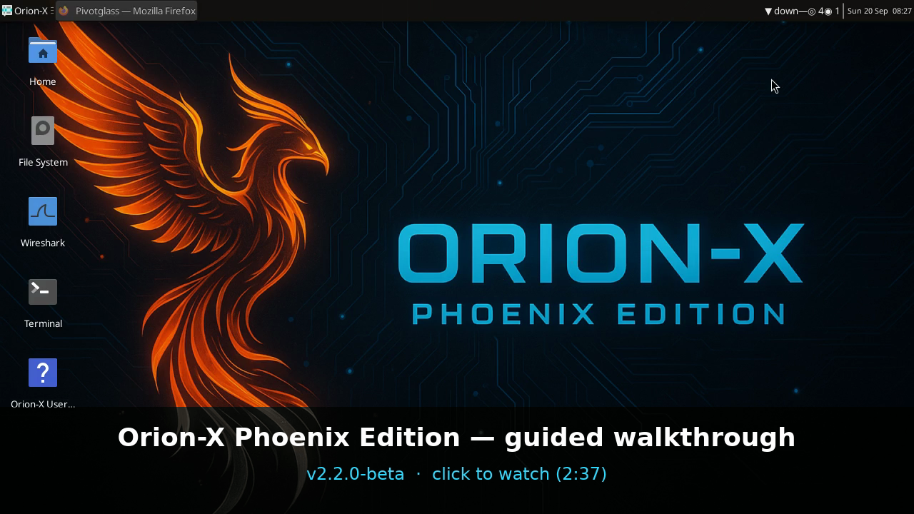

# Orion-X Phoenix Edition — Cyberdeck for the Good Guys

**Version:** v2.2.0-beta — "OrionX Beta" ([download](https://github.com/jarocki/orion/releases/tag/v2.2.0-beta), pre-release)
**Base:** Debian 13 "trixie" live (kernel 6.12, Python 3.13, XFCE 4.20) | **Runtime:** Qwen2.5-3B-Instruct (Apache-2.0)
**Previous line:** v2.1.0-bullseye-rain (final Debian 11 build, kept as a known-good fallback)

Orion-X is a **live, USB-bootable cyberdeck** for incident responders working in
contested network infrastructure. It boots to a locked-down forensic-first Linux
environment with an AI copilot, mesh-encrypted team comms, and a curated malware
analysis toolkit — designed to work fully air-gapped.

Mission verbs: **monitor** / **detect** / **defend** / **triage** / **timeline**.

[](docs/media/orionx-guided-demo-v2.2.0-beta.mp4)

**[Watch or download the guided walkthrough (2½ min)](docs/media/orionx-guided-demo-v2.2.0-beta.mp4)** ·
**[Captions](docs/media/orionx-guided-demo-v2.2.0-beta.vtt)** ·
**[Read the transcript](docs/media/orionx-guided-demo-v2.2.0-beta-transcript.md)**

The walkthrough is recorded from the beta's own desktop and applications
(`tools/guided-demo/`, rebuilt per release from `scenes.yaml`); the Cockpit shows
its built-in synthetic demo feed and the narration is synthesised offline.

---

## What's on the ISO

### Detection and Triage

- **radare2** — reverse engineering framework
- **YARA** — malware pattern matching; freshen rulesets via `sudo orionx-freshen-yara`
- **Suricata IDS** — lazy-start network IDS; enable with
  `sudo touch /var/lib/suricata/orionx-enabled && systemctl start suricata`;
  freshen rules via `sudo orionx-freshen-suricata`
- **capa** — capability detection for binaries (`/opt/orionx/venv/re/`)
- **ssdeep**, **md5deep**, **python3-pefile** — fuzzy hashing and PE parsing
- **volatility3** — memory forensics
- **Wireshark / tshark / tcpdump** — network capture and analysis
- **bulk_extractor** — feature extraction from disk images and captures

### AI Copilot — Nebula Runtime

- **Ollama** serving **Qwen2.5-3B-Instruct Q4_K_M** locally (1.9 GB, Apache-2.0,
  approximately 2-3x faster than Mistral-7B on CPU — see DEC-PHASE11-002)
- **Integrity check** — SHA256-verified on boot via `nebula-integrity-check.service`
  (DEC-PHASE10-008 trust-on-first-use)
- **AppArmor confined** — LOCAL-ONLY policy, sandbox per DEC-006/DEC-007
- **Lazy-start** — socket-activated to save RAM until first inference request

### Team Comms (Mesh)

- **Matrix homeserver** (Synapse) over Phase 3 WireGuard mesh
- **matrix-commander** — CLI Matrix client at `/opt/orionx/venv/comms/`
- **Element desktop** — available via optional installer (see below)

### Optional Installers (network-connected nodes only)

Tools too large or freshness-sensitive for the base ISO live under
`/opt/orionx/optional/`. Run any installer as root on a network-connected node:

| Script | What it installs |
|---|---|
| `install-clamav.sh` | ClamAV (~350 MB; signature freshness decays — hence optional) |
| `install-ghidra.sh` | NSA Ghidra reverse engineering suite |
| `install-element.sh` | Element Matrix desktop client |
| `install-floss.sh` | Mandiant FLOSS string extractor |
| `install-trid.sh` | TrID file type identification |
| `install-gomuks.sh` | Gomuks Matrix TUI client |

All installers share `orionx-installer-common.sh`: root check, network check,
apt/wget helpers, and SHA256 verification. See `docs/User_Guide.md` for usage.

### Diagnostic Tool

- **`orionx-diag`** — 200-assertion self-check across 10 categories
  (identity, packages, files, systemd, python, nebula, branding, freshen, optional, manifest)
- `orionx-diag --json` for machine-readable output
- `orionx-diag --category <name>` for targeted probes
- See `docs/orionx-diag.md` for full reference.

### Cyberdeck Visual Identity

- **Plymouth**: Phoenix splash on boot (`orionx-phoenix` theme)
- **GRUB / isolinux**: plain, readable text menus (the graphical GRUB theme was retired after failing on hardware — DEC-PHASE11-044; the boot identity is the Plymouth splash)
- **Orion Cockpit**: live Cairo dashboard on the R.A.I.N. event bus (`orionx-cockpit`, ◈ COCKPIT in the Control Center); every Orion-X tool lives under the **Orion** application menu
- **LightDM greeter**: Orion-X-Greeter with Phoenix backdrop
- **XFCE GTK theme**: `Orion-X-Cyberdeck` (Adwaita-dark fork with Phoenix red-orange `#FF5722` accent)
- **Icons**: `Orion-X-Icons` (Papirus-Dark inheritance + 4 custom SVG icons)
- **Fonts**: **Iosevka** (primary, SIL OFL-1.1) + **Hack** (secondary, Apache-2.0) — community-developed only per DEC-PHASE11-013
- **MOTD** with ASCII wordmark on terminal login

---

## Quick Start

### 1. Get the ISO

**OrionX Beta (v2.2.0-beta, 3.09 GB):** GitHub caps release assets at 2 GB per
file, so the ISO is published as seven `.part-*` files (`part-aa` … `part-ag`,
≤1000 MiB each) plus `SHA256SUMS` and `REASSEMBLE.txt` on the
[release page](https://github.com/jarocki/orion/releases/tag/v2.2.0-beta).
Download all of them into one directory, then:

```bash
cat orionx-phoenix-edition-v2.2.0-beta.iso.part-* > orionx-phoenix-edition-v2.2.0-beta.iso
shasum -a 256 -c SHA256SUMS      # Linux: sha256sum -c SHA256SUMS
```

The reassembled ISO must hash to
`606e6179887ff7f82e9d05ed973333856c153a692d45983e16e35b12a0f0e49f`. A single
`.part-*` file is not bootable on its own.

**Option A — Host imager tool (recommended):**

```bash
# GUI (macOS / Linux)
scripts/orionx-imager/orionx-imager

# CLI
scripts/orionx-imager/orionx-imager-cli.sh --list-devices
scripts/orionx-imager/orionx-imager-cli.sh --iso-release latest --target /dev/disk4
```

The imager downloads the latest GitHub release, verifies SHA256, and guides the
USB write. It refuses `/dev/disk0` and `/dev/sda` (internal-disk safety). See
`docs/orionx-imager.md` for full reference.

**Option B — Manual dd:**

```bash
# macOS
diskutil list
sudo dd if=orionx-phoenix-edition-*.iso of=/dev/rdisk4 bs=4m status=progress

# Linux
lsblk
sudo dd if=orionx-phoenix-edition-*.iso of=/dev/sdX bs=4M status=progress conv=fsync
```

### 2. Boot the target machine from USB

- Boot menu key varies: F12 / F10 / Esc — check your hardware
- Autologin as `orionx-operator` (passwordless live account with passwordless sudo)
- Hostname: `orionx`

### 3. Verify the boot

```bash
# Full self-check (run on the booted live system)
orionx-diag

# Targeted check
orionx-diag --category identity
orionx-diag --category nebula
```

Expected: all identity, manifest, packages, files, and systemd categories PASS.
See `docs/orionx-diag.md` for interpreting results.

---

## Development

```bash
make lint              # ShellCheck + ruff
make test-unit         # bash + python unit tests (~1400+ assertions)
make iso-build         # Full ISO build (Linux only; use Docker on macOS)
make docker-build      # Build the Debian Trixie container for ISO builds
# macOS: scripts/build-iso.sh delegates to debian:trixie-slim automatically;
# set ORIONX_VERSION=<tag> explicitly (git-describe resolves to the last tag).
make test-qemu-boot    # UEFI + BIOS QEMU boot smoke tests
```

CI pipelines: `.github/workflows/{lint,qemu-test,e2e-test,release}.yml`.

Contributor guide: [docs/CONTRIBUTING.md](docs/CONTRIBUTING.md).

---

## Documentation

- [User Guide](docs/User_Guide.md) — Comprehensive operator manual
- [orionx-diag](docs/orionx-diag.md) — Diagnostic tool reference
- [orionx-imager](docs/orionx-imager.md) — Host-side USB writer reference
- [Release Process](docs/release-process.md) — rc-cut and hotfix cadence
- [Development Checklist](docs/DEVELOPMENT_CHECKLIST.md) — Contributor pre-commit gates
- [Architecture Decisions](MASTER_PLAN.md) — DEC-PHASE*-xxx series is canonical

---

## Phase 11 Status

16 slices landed on develop (2026-07-19 arc):

| Slice | What |
|---|---|
| W11-1 | Nebula Qwen2.5-3B model swap (−2.5 GB, Apache-2.0) |
| W11-2 | Debloat (14 packages removed) + bootloader single-authority generator |
| W11-2b | SC2001 shellcheck hotfix |
| W11-2c | CI content-presence 4-failure hotfix |
| W11-2d | CI structural rewrite (16f) |
| W11-2e | Qwen SHA256 pin (closes #67) |
| W11-2f | XFCE screen lock disable (closes #76) |
| W11-9a | Plymouth + GRUB + isolinux + LightDM boot chain branding |
| W11-9a2 | GRUB theme activation in generator (closes #74) |
| W11-9b | Desktop branding (GTK/icons/fonts) + R6 root-cause fix (DEC-PHASE11-014) |
| W11-3 | RE toolkit Layer A (radare2, ssdeep, md5deep, pefile, capa) |
| W11-4 | YARA rulesets skeleton + orionx-freshen-yara |
| W11-5 | matrix-commander pip venv + comms skeleton |
| W11-6 | Suricata IDS Layer A (lazy-start + orionx-freshen-suricata) |
| W11-7 | ClamAV dropped from base ISO to optional installer |
| W11-8 | Optional installer framework (shared lib + 6 stubs) |
| W11-11 | `orionx-diag` 200-assertion in-ISO diagnostic tool |
| W11-12 | `orionx-imager` host-side USB writer (GUI + CLI, macOS/Linux) |

**Phase 12 (Trixie line, v2.2.0-beta):** base flip to Debian 13, Orion Cockpit,
Orion menu, R.A.I.N., go-roast, nucleotide, Pivotglass, User Guide rewrite,
image trim 6.63 GB → 3.09 GB (DEC-PHASE12-001 … -017).

**Next:** move the language model out of the ISO into its own release asset so
the ISO itself fits GitHub's 2 GB single-asset limit (~1.2 GB projected);
imager-created persistence partition; merge `feat/trixie-migration` → `develop`;
update `release.yml` for the Trixie build container.

**ISO size:** 3.09 GB (v2.2.0-beta); target <2 GB without the bundled model.

---

## License and Attribution

Orion-X Phoenix Edition is distributed under **GPL-3.0**. Third-party components
carry their own licenses — see `manifest.json` for the full inventory.

Key permissive dependencies:
- Qwen2.5-3B-Instruct (Apache-2.0)
- Iosevka font (SIL OFL-1.1)
- Hack font (Bitstream Vera / Apache-2.0)
- ET-Open Suricata rules (BSD-2-Clause)
- YARA rules (licensing split documented in `/opt/orionx/yara/README.md`)

Explicitly **not** shipped: JetBrains software (per DEC-PHASE11-013 — community-developed fonts only).

---

## Support

- Issues: https://github.com/jarocki/orion/issues
- [docs/SUPPORT.md](docs/SUPPORT.md)
- [docs/CONTRIBUTING.md](docs/CONTRIBUTING.md)
