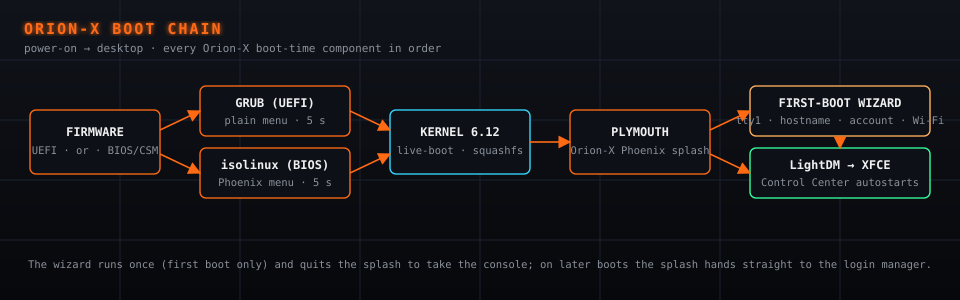
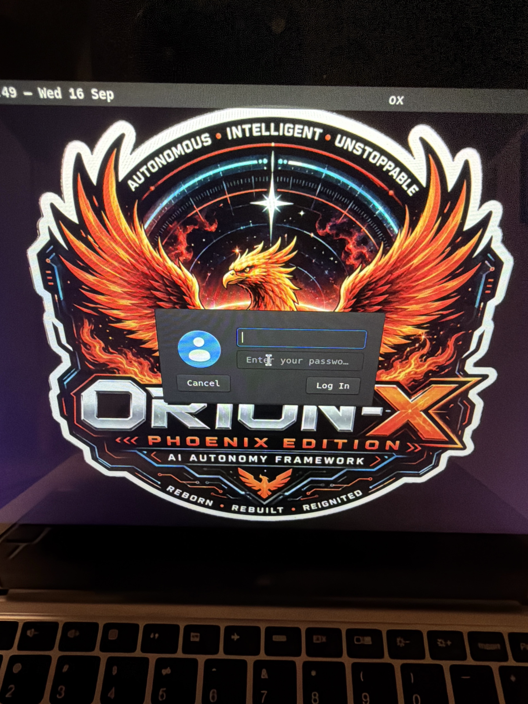
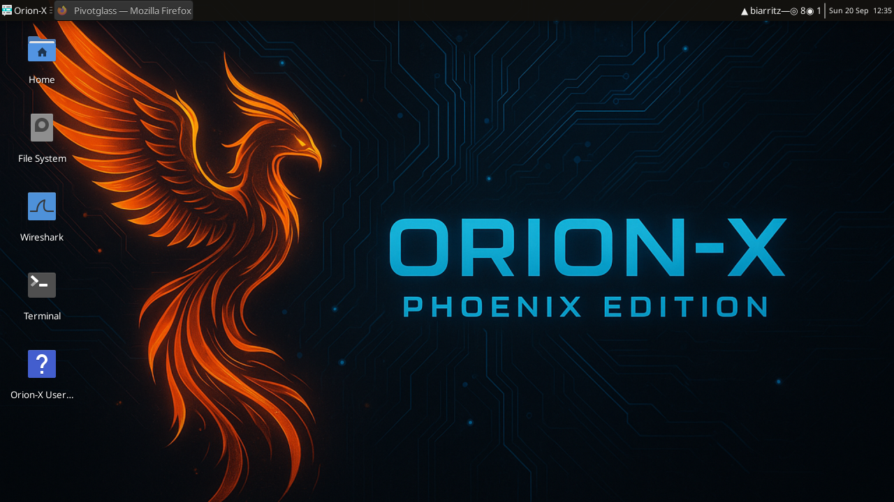
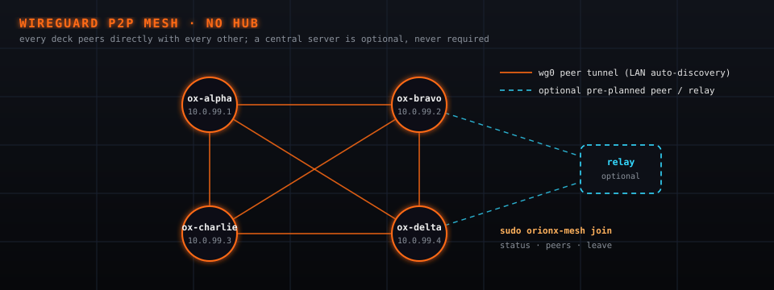
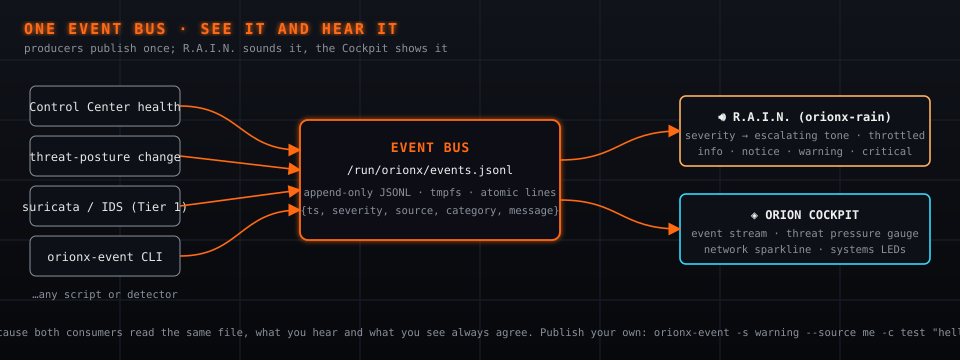
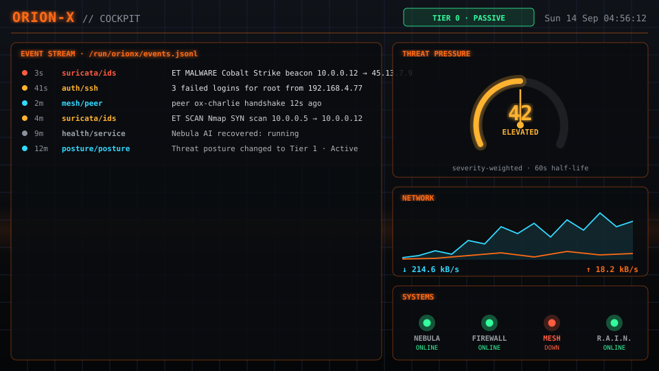
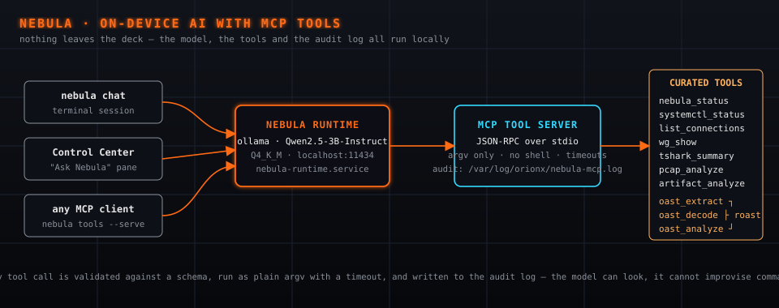

# Orion-X Phoenix Edition User Guide

Release: **v2.2.0-rc5** (v2.2.0 line, Trixie; release candidate after v2.2.0-beta) — Debian 13 "trixie", Python 3.13, Linux 6.12. This guide describes the rc5 image; where v2.2.0 final differs, the text says so.

## Table of Contents

1. [Introduction](#1-introduction)
   - [About Orion-X Phoenix Edition](#about-orion-x-phoenix-edition)
   - [Key Features](#key-features)
   - [Use Cases](#use-cases)

2. [Getting Started](#2-getting-started)
   - [System Requirements](#system-requirements)
   - [Creating Bootable Media](#creating-bootable-media)
   - [Verifying the Download and the Boot](#verifying-the-download-and-the-boot)

3. [Booting and Initial Setup](#3-booting-and-initial-setup)
   - [Boot Menu and Boot Chain](#boot-menu-and-boot-chain)
   - [First-Boot Wizard](#first-boot-wizard)
   - [Persistence Options](#persistence-options)

4. [The Desktop](#4-the-desktop)
   - [Orion Application Menu](#orion-application-menu)
   - [Top Panel Widgets](#top-panel-widgets)
   - [Control Center](#control-center)

5. [Networking](#5-networking)
   - [Connecting to Local Networks](#connecting-to-local-networks)
   - [Setting Up WireGuard VPN](#setting-up-wireguard-vpn)
   - [WireGuard P2P Mesh](#wireguard-p2p-mesh)
   - [Network Configuration Verification](#network-configuration-verification)

6. [Secure Communication](#6-secure-communication)
   - [Matrix Setup](#matrix-setup)
   - [Matrix Clients](#matrix-clients)
   - [Communication Best Practices](#communication-best-practices)

7. [Awareness: R.A.I.N. and the Orion Cockpit](#7-awareness-rain-and-the-orion-cockpit)
   - [R.A.I.N. — Real-time Audible Intrusion Notification](#rain-real-time-audible-intrusion-notification)
   - [The Event Bus](#the-event-bus)
   - [Orion Cockpit](#orion-cockpit)
   - [Orion Workbench (analyst toolbox)](#orion-workbench-analyst-toolbox)
   - [GODSEYE (globe)](#godseye-globe)
   - [DJ Deck (optional music)](#dj-deck-optional-music)

8. [Nebula AI](#8-nebula-ai)
   - [Using Nebula](#using-nebula)
   - [MCP Tools](#mcp-tools)
   - [go-roast: OAST Triage](#go-roast-oast-triage)
   - [Pivotglass: Adversary-Infrastructure Hunting](#pivotglass-adversary-infrastructure-hunting)

9. [Forensic Evidence Collection](#9-forensic-evidence-collection)
   - [Memory Acquisition](#memory-acquisition)
   - [Disk Imaging](#disk-imaging)
   - [Network Traffic Capture](#network-traffic-capture)
   - [Log Collection](#log-collection)
   - [Chain of Custody Documentation](#chain-of-custody-documentation)

10. [Artifact Analysis](#10-artifact-analysis)
    - [Using artifact-analyzer.py](#using-artifact-analyzerpy)
    - [Memory Analysis](#memory-analysis)
    - [Disk Analysis](#disk-analysis)
    - [Network Analysis](#network-analysis)
    - [Log Analysis](#log-analysis)
    - [Detection and Classification Tools](#detection-and-classification-tools)

11. [Timeline Generation](#11-timeline-generation)
    - [Using storyboard-gen.py](#using-storyboard-genpy)
    - [Working with Multiple Log Sources](#working-with-multiple-log-sources)
    - [Visualizing the Timeline](#visualizing-the-timeline)

12. [Data Management](#12-data-management)
    - [Local Storage Options](#local-storage-options)
    - [Uploading to Artifact Vault](#uploading-to-artifact-vault)
    - [Data Security Considerations](#data-security-considerations)

13. [Customization](#13-customization)
    - [Switching Visual Themes](#switching-visual-themes)
    - [Visual Identity](#visual-identity)
    - [Customizing Terminal Environment](#customizing-terminal-environment)
    - [Adding Custom Tools](#adding-custom-tools)

14. [Sample Data](#14-sample-data)
    - [Working with PCAP Samples](#working-with-pcap-samples)
    - [Memory Dump Analysis](#memory-dump-analysis)
    - [Firmware Analysis](#firmware-analysis)
    - [Log File Examples](#log-file-examples)

15. [Optional Installers](#15-optional-installers)

16. [Troubleshooting](#16-troubleshooting)
    - [Boot Issues](#boot-issues)
    - [Network Connectivity](#network-connectivity)
    - [VPN and Mesh Troubleshooting](#vpn-and-mesh-troubleshooting)
    - [Matrix Connection Issues](#matrix-connection-issues)
    - [R.A.I.N. and Nebula Issues](#rain-and-nebula-issues)
    - [Tool Execution Problems](#tool-execution-problems)

17. [Appendices](#17-appendices)
    - [Command Reference](#command-reference)
    - [File Locations](#file-locations)
    - [Keyboard Shortcuts](#keyboard-shortcuts)

## 1. Introduction

### About Orion-X Phoenix Edition

Orion-X Phoenix Edition is a complete Linux system on a USB stick for incident response and digital forensics. You start a computer from the stick instead of from its own disk; Orion-X runs entirely from memory, installs nothing, and leaves no files on that computer. It brings its own tools — network capture, memory and disk forensics, malware triage, encrypted team chat, an on-device AI assistant — and works without any internet connection.

The "Phoenix" name symbolizes the toolkit's ability to help organizations rise from the ashes of security incidents through effective investigation and response. The current release, **v2.2.0-rc5** (Trixie line), is built on Debian 13 "trixie" with Python 3.13 and Linux 6.12. It adds an on-device AI assistant (Nebula), audible intrusion alerts (R.A.I.N.), a live visualization dashboard (the Orion Cockpit), a peer-to-peer WireGuard mesh, and a graphical Control Center.

**About the beta and rc5.** v2.2.0-beta has been boot-tested on one reference laptop (Lenovo, Intel Bay Trail, UEFI) and in QEMU. It is complete enough to use, but expect rough edges, and please report anything confusing or broken (see [Support](SUPPORT.md)). Known limits of the beta, and what the rc5 release candidate changes:

- x86-64 PCs only (it does not boot Apple-silicon Macs); Secure Boot must be off.
- Nothing you change survives a reboot unless you set up [persistence](#persistence-options).
- The beta image identifies itself as `ISO_VERSION=v2.2.0-trixie-dev9` in `/etc/orionx-version` and the terminal welcome text. That is the v2.2.0-beta build (ISO SHA-256 `606e6179…e49f`). rc5 reports `ISO_VERSION=v2.2.0-rc5`; v2.2.0 final will report `v2.2.0`.
- The self-check tool `orionx-diag` is missing from the beta image; it ships again from rc5 (DEC-PHASE12-021).
- `radare2` and `bulk_extractor` are not on the image, although earlier release text listed them; Ghidra is available as an optional installer (§15).
- The bare `sudo setup-matrix.sh` command exits with "`--mode` is required" on the beta; pass `--mode client` or `--mode server` (§6). rc5 and later prompt for the mode instead.
- The copy of this guide and the README baked into the image at `/usr/share/doc/orionx/` predates the beta; the versions on GitHub are current. rc5 bakes the guide current at build time, and the release check compares the baked copy against the repository before anything is published.

#### Words this guide uses

- **ISO / image** — the single file that contains the whole Orion-X system; you copy it onto a USB stick.
- **Live system** — an operating system that runs from removable media and memory instead of being installed.
- **Shields Up** — Orion-X's posture levels. The deck raises its active
  defenses as the situation demands, rather than assuming one fixed stance.
  Most capabilities work with no network connection, and the AI assistant
  never sends your data anywhere regardless of posture (DEC-006). Note we
  deliberately avoid the term *air-gapped*: almost nothing truly is, and
  believing otherwise is how people get caught out.
- **SHA-256 / hash** — a fingerprint of a file. If your copy's fingerprint matches the published one, the file is intact.
- **UEFI / BIOS / Secure Boot** — the computer's firmware and its start-up rules. Secure Boot must be off for the beta to start.
- **Deck** — an Orion-X machine (from "cyberdeck"). **Node** — the same thing, seen from the network.
- **Mesh** — several decks joined to each other over encrypted WireGuard links.
- **Event bus** — the file every Orion-X detector writes alerts to; R.A.I.N. and the Cockpit read it.
- **MCP tools** — the fixed set of local commands the Nebula assistant is allowed to run (MCP is the protocol it uses to call them).
- **Persistence** — keeping changes between reboots on an extra partition you add to the stick.
- **Terminal** — the window where you type commands. On the desktop: Applications → Terminal Emulator, or the terminal icon in the top panel.
- **sudo** — prefix that runs one command as the administrator ("root"). The live account may use it without a password.
- **Service** — a background program managed by `systemctl` (for example `nebula-runtime.service`, which runs the AI assistant).
- **IDS** — intrusion detection system; here, Suricata, which inspects network traffic against rule files.

### Key Features

- **Hardened Linux Environment**: Debian 13 "trixie" base, runs from memory with the stick's read-only image; optional encrypted persistence (§3)
- **Control Center**: One window for network, mesh, comms, awareness, IR (incident response) tools, Nebula AI and auto-healing — designed for your 3am self
- **R.A.I.N.**: Real-time Audible Intrusion Notification — hear intrusions without watching the screen
- **Orion Cockpit**: Live dashboard of the event stream, threat pressure, network activity and system status
- **Nebula AI**: On-device language model (ollama serving Qwen2.5-3B-Instruct) with tool access through MCP. It answers on 127.0.0.1 only and needs no internet; see §8 for exactly what "local" covers
- **Secure Communication**: Matrix setup (client or homeserver) for encrypted team chat — the Matrix software itself is installed over the network (§6)
- **Private Networking**: WireGuard VPN and a peer-to-peer WireGuard mesh between Orion-X nodes
- **Comprehensive Forensic Tools**: Built-in utilities for memory acquisition, disk imaging, network analysis, detection (suricata, yara, capa) and OAST triage (go-roast)
- **Automated Analysis**: Custom scripts for rapid artifact processing and timeline generation
- **Sample Data Library**: Synthetic forensic samples on the image, public samples fetched on demand (§14)
- **Visual Distinction**: A terminal colour toggle (dark/amber and green) to tell operating contexts apart (§13)
- **Documentation**: This guide and reference materials accessible within the environment

### Use Cases

Orion-X Phoenix Edition is ideal for:

- **Security Incident Response**: Investigating suspected compromises or breaches
- **Digital Forensics**: Collecting and analyzing digital evidence
- **Malware Analysis**: Examining suspected malicious code in a controlled environment
- **Security Training**: Teaching incident response and forensic techniques
- **Penetration Testing**: As part of a security assessment toolkit
- **Emergency Response**: Quick deployment for urgent security situations

## 2. Getting Started

### System Requirements

To effectively run Orion-X Phoenix Edition, your system should meet these minimum requirements:

- **CPU**: 64-bit Intel/AMD processor (x86_64). Apple-silicon Macs and other ARM machines cannot boot it.
- **RAM**: 4GB minimum (8GB+ recommended for memory analysis; Nebula AI needs ~2.5 GB free to load its model)
- **Storage**: 8GB+ USB drive for bootable media — everything on it is erased
- **Boot Support**: UEFI or Legacy BIOS, with **Secure Boot disabled** (the beta's bootloader is unsigned; the firmware shows "Invalid signature" or silently skips the stick otherwise)
- **Network**: Wired or wireless network adapter (optional — Orion-X works fully offline)

Before you change firmware settings on a **Windows laptop with BitLocker**, make sure you have the BitLocker recovery key (Microsoft account → Devices → Manage recovery keys): Windows may ask for it on the next Windows start after Secure Boot is toggled. Booting Orion-X does not read or modify the internal disk unless you mount or image it yourself; re-enable Secure Boot afterwards if your organisation requires it.

For intensive operations like memory analysis of large dumps or processing multiple disk images, we recommend:

- **RAM**: 16GB or more
- **CPU**: Multi-core processor
- **Storage**: Additional external storage for saving artifacts

### Creating Bootable Media

Before you can use Orion-X, you need to create bootable media (typically a USB drive). Release images follow the name pattern `orionx-phoenix-edition-<version>.iso`.

#### Downloading a release published in parts

GitHub limits release assets to 2 GB per file, so releases larger than that (including **v2.2.0-beta**, 3.09 GB, published as seven parts `part-aa` … `part-ag`) are published as several `orionx-phoenix-edition-<version>.iso.part-*` files together with `SHA256SUMS` and `REASSEMBLE.txt`. Download every part listed in `SHA256SUMS` into the same directory and join them before writing anything to USB:

```bash
# Linux / macOS
cat orionx-phoenix-edition-<version>.iso.part-* > orionx-phoenix-edition-<version>.iso
sha256sum -c SHA256SUMS        # macOS: shasum -a 256 -c SHA256SUMS
```

```powershell
# Windows (PowerShell)
# list EVERY part from SHA256SUMS, in order (v2.2.0-beta has part-aa … part-ag)
cmd /c copy /b orionx-phoenix-edition-<version>.iso.part-aa + orionx-phoenix-edition-<version>.iso.part-ab + orionx-phoenix-edition-<version>.iso.part-ac + orionx-phoenix-edition-<version>.iso.part-ad + orionx-phoenix-edition-<version>.iso.part-ae + orionx-phoenix-edition-<version>.iso.part-af + orionx-phoenix-edition-<version>.iso.part-ag orionx-phoenix-edition-<version>.iso
Get-FileHash orionx-phoenix-edition-<version>.iso -Algorithm SHA256
```

Run these in the folder that holds the downloads (`cd ~/Downloads` first if that is where they are). The parts are deliberately uneven: for v2.2.0-beta, `part-aa` and `part-ab` are 1000 MiB each and `part-ac` … `part-ag` are about 190 MiB each — that is expected, not a truncated download. On Windows, Explorer shows the joined file as about 2.88 GB (it counts in GiB); that is the same 3.09 GB file.

`SHA256SUMS` lists the whole ISO **and** each part, so a corrupted download can be identified and re-fetched individually: the check prints one `OK` line per file (eight for the beta); re-download any file marked `FAILED` and run the check again. If you delete the parts after joining, the seven part lines report "No such file" — only the `.iso` line matters then. A single `.part-*` file is not bootable.

#### Recommended: orionx-imager

`orionx-imager` is the host-side USB writer for **macOS and Linux** (it does not run on Windows yet — Windows users follow the Rufus steps below). It lives in the repository (`git clone https://github.com/jarocki/orion.git`, then `scripts/orionx-imager/orionx-imager`), needs only Python 3, and downloads the release for you — releases published in parts are reassembled and verified automatically — checks the SHA-256, refuses to write to internal disks, asks for your password inside the app, and shows a byte-accurate progress bar while writing. For the beta, name the tag: `--iso-release v2.2.0-beta` (plain `latest` means the latest *stable* release). See [orionx-imager.md](orionx-imager.md).

#### Alternative: dd (Linux)

1. Download the Orion-X Phoenix Edition ISO file
2. Open a terminal and identify your USB device:
   ```bash
   lsblk
   ```
3. Create bootable media (replace `/dev/sdX` with your device):
   ```bash
   sudo dd if=/path/to/orionx-phoenix-edition-<version>.iso of=/dev/sdX bs=4M status=progress conv=fsync
   ```

#### Alternative: Rufus or balenaEtcher (Windows)

1. Download every `.part-*` file plus `SHA256SUMS` and reassemble the ISO with `copy /b` as shown above; check the hash with `Get-FileHash` (PowerShell prints it in capital letters — only the letters and digits matter, not their case)
2. Download and install [Rufus](https://rufus.ie) (portable version is fine) or [balenaEtcher](https://www.balena.io/etcher/)
3. Insert your USB drive (8 GB or more; it will be erased)
4. In Rufus: **Device** = your USB stick (check the size matches), **Boot selection** = the reassembled `.iso`, leave **Partition scheme** and the other defaults as Rufus proposes, click **START**
5. When Rufus asks how to write the image, choose **"Write in DD Image mode"** — the "ISO Image mode" option does not boot Orion-X correctly
6. If Windows pops up "You need to format the disk … before you can use it", click **Cancel** — the stick is correct; Windows simply cannot read Linux partitions
7. Wait for READY, close Rufus, and eject the stick from the taskbar before unplugging

#### Alternative: dd (macOS)

1. Download the Orion-X Phoenix Edition ISO file
2. Open Terminal and identify your USB drive:
   ```bash
   diskutil list
   ```
3. Unmount the drive (replace `N` with your disk number):
   ```bash
   diskutil unmountDisk /dev/diskN
   ```
4. Create bootable media:
   ```bash
   sudo dd if=/path/to/orionx-phoenix-edition-<version>.iso of=/dev/rdiskN bs=1m
   ```
5. Eject the drive when complete:
   ```bash
   diskutil eject /dev/diskN
   ```

### Verifying the Download and the Boot

Nothing is installed on the computer — this checks the file you downloaded and the stick you booted.

1. Calculate the SHA-256 hash of the ISO before writing it to USB:
   ```bash
   # Linux
   sha256sum orionx-phoenix-edition-<version>.iso
   ```
   ```bash
   # macOS
   shasum -a 256 orionx-phoenix-edition-<version>.iso
   ```
   ```powershell
   # Windows (PowerShell) — prints the hash in capitals; case does not matter
   Get-FileHash orionx-phoenix-edition-<version>.iso -Algorithm SHA256
   ```

2. Compare the result with the hash on the release page and in `SHA256SUMS` (`orionx-imager` does this for you when it downloads the release). For v2.2.0-beta the ISO hashes to `606e6179887ff7f82e9d05ed973333856c153a692d45983e16e35b12a0f0e49f`.

3. After booting Orion-X, open a terminal and check the image identity:
   ```bash
   grep ISO_VERSION= /etc/orionx-version
   ```
   The beta prints `ISO_VERSION=v2.2.0-trixie-dev9` (see *About the beta* in §1); v2.2.0 final prints `ISO_VERSION=v2.2.0`.

4. On v2.2.0 (not the beta image, which lacks the tool), run the built-in self-check: `sudo orionx-diag`. See [orionx-diag.md](orionx-diag.md).

## 3. Booting and Initial Setup

### Boot Menu and Boot Chain

What you see depends on how your firmware boots the USB drive:

- **UEFI**: a plain, readable GRUB menu with two entries — **Orion-X Live** and **Orion-X Live (failsafe)**. The default entry boots after a 5 s timeout.
- **Legacy BIOS**: the same two entries on the themed isolinux menu.

After you choose an entry, the Plymouth **"Orion-X Phoenix"** splash is shown while the kernel and live system start. On the very first boot the splash is followed by the first-boot wizard on the console (next section); when it finishes, the desktop opens **already logged in** as the primary account. On later boots (persistence) the system goes straight to the desktop. The login screen appears only if you log out or lock the screen.



*Figure: From power-on to desktop — firmware, boot menu, Plymouth splash, first-boot wizard, login screen.*

To edit kernel parameters for a single boot, press **e** in the GRUB menu (UEFI) or **Tab** in the isolinux menu (BIOS), append the parameters, and boot.

### First-Boot Wizard

Before the desktop appears, Orion-X pauses on the text console (tty1) and shows a full-screen banner: **"the boot has PAUSED — your input is needed."** This is the first-boot wizard, not a crash. It runs whenever its completion marker `/var/lib/orionx/.first-boot-done` is absent — on a plain (amnesic) stick that is **every boot**, because nothing is kept between boots; with persistence set up it runs once. The wizard asks, in order:

1. **Hostname** for this deck — press Enter for the default `orionx-node`
2. **Primary account** — the account name (default `orionx-operator`; if you change it, the live user is renamed) and a password. **Leave the password blank to keep the account passwordless** (the default; convenient on a disconnected deck, unwise on a shared network). The account can use `sudo` either way.
3. **Wi-Fi** — network name (SSID) and password, asked **only** when no wired link is detected

Every prompt auto-continues with its default after 120 seconds, so an unattended boot still completes (worst case about six minutes at the banner). When the wizard finishes, the desktop opens automatically logged in as the primary account — there is no login prompt on a normal boot. If you log out, the login screen asks for the password you set (press Enter if you left it blank).

The wizard also does three things without asking:

- **Generates WireGuard keys** for the mesh (`/etc/wireguard/wg0.conf` and `/etc/wireguard/mesh-private.key`), so `orionx-mesh join` works immediately.
- **Prints an "SSH admin one-shot" credential** (a random password, a key fingerprint and a private key) to the console and writes it to `/etc/motd.d/orionx-ssh-admin` and `/etc/issue.d/orionx-ssh-admin.issue`, so you also see it in the terminal welcome text. **In this beta the credential cannot be used**: it targets the `root` account, and the image's SSH hardening disables root login. Ignore it. To remove the text from the login prompt and the terminal welcome:
  ```bash
  sudo rm -f /etc/motd.d/orionx-ssh-admin /etc/issue.d/*
  ```
  SSH itself stays enabled; disable it with `sudo systemctl disable --now ssh` if you do not need it.
- **Skips Matrix registration** on the image (the Synapse server is not installed until you run `setup-matrix.sh --mode server`, §6).

You can re-run the wizard at any time:

```bash
sudo orionx-wizard
```



*Figure: Login screen.*

### Persistence Options

Orion-X can operate in two primary modes:

#### Amnesic Mode (Default)

- Runs entirely in RAM
- Leaves no trace on the host system
- All changes are lost on reboot
- Ideal for maximum security and forensic integrity

#### Persistent Mode

- Changes are saved between reboots
- Configurations, collected evidence, and installed tools are preserved
- Optional encrypted persistence for sensitive data

**Advanced — skip this on your first boot.** Forgetting everything at power-off is the safe default, and the steps below repartition the very stick you booted from. Before you start, copy anything you want to keep to a second USB drive (§12).

A USB stick written with `dd` or `orionx-imager` contains **two** partitions (the live system and the EFI system partition). Persistence needs a **third** partition, which you create yourself in the free space after the image. Persistence is **enabled by default**: `persistence` is already on the kernel command line of both boot entries, so Debian live-boot automatically uses any partition labelled `persistence` that contains a `persistence.conf` file. Only an *encrypted* volume needs a boot-menu edit (`persistence-encryption=luks`).

To set up encrypted persistence:

1. Boot Orion-X normally
2. Find the stick and create a third partition in its free space. Run `lsblk` first: the stick is the small device (8–64 GB) that carries the two Orion-X partitions; the computer's own disk is the large one — do not touch it. Replace `/dev/sdX` with the USB device, not a partition:
   ```bash
   lsblk
   sudo fdisk /dev/sdX      # n (new), accept defaults to use the free space, w (write)
   lsblk /dev/sdX           # confirm the new partition, e.g. /dev/sdX3
   ```
3. Format it as an encrypted persistence volume:
   ```bash
   sudo cryptsetup luksFormat /dev/sdX3
   sudo cryptsetup luksOpen /dev/sdX3 orionx_persist
   sudo mkfs.ext4 -L persistence /dev/mapper/orionx_persist
   sudo mount /dev/mapper/orionx_persist /mnt
   echo "/ union" | sudo tee /mnt/persistence.conf
   sudo umount /mnt
   sudo cryptsetup luksClose orionx_persist
   ```
4. Reboot; at the boot menu press **e** (GRUB) or **Tab** (isolinux), append `persistence-encryption=luks` to the line that starts with `linux` (GRUB) or `append` (isolinux), then press **Ctrl+X** or **F10** (GRUB) or **Enter** (isolinux) to boot. You will be asked for the passphrase during boot. The menu waits 5 s, so press a key as soon as it appears.

For an **unencrypted** persistence volume, skip the `cryptsetup` lines (`sudo mkfs.ext4 -L persistence /dev/sdX3`, then write `persistence.conf` to it) and reboot — no boot-menu edit is needed.

## 4. The Desktop

After login you land on the XFCE desktop with the Phoenix wallpaper, a top panel with live status widgets, and the Control Center, which starts automatically.



*Figure: Orion-X desktop.*

### Orion Application Menu

Applications → **Orion** (Phoenix icon) groups the Orion-X tools:

- **Orion-X Control Center**
- **Orion Cockpit**
- **Orion-X Mesh**
- **Orion-X — Start Mesh**
- **Orion-X Matrix Setup**
- **Orion-X Matrix Comms (CLI)** — the `matrix-commander` terminal client
- **Orion-X Artifact Analyzer**
- **Orion-X Storyboard Generator**
- **Pivotglass**
- **Orion Workbench** — the analyst toolbox: local web tools and every Orion-X tool in one page (§7)
- **CyberChef (local)**
- **Orion-X Attack Map**
- **GODSEYE (globe)** — opens the network preflight, not the globe (§7)
- **Orion-X DJ Deck** — optional music, off by default (§7)

### Top Panel Widgets

The top panel shows, left to right:

| Widget | Meaning |
|---|---|
| ▲ *interface* | Active network interface; shows ▼ when offline |
| ◆ *N peers* | Connected mesh peers; shows — when the mesh is idle |
| ◎ *scans* | Number of scan / intrusion-detection events published to the event bus since boot (categories `ids`, `scan`, `recon`, `probe`, or sources `suricata`, `zeek`, `nucleotide`). `◎ 0` on a quiet deck is normal |
| ◉ *clients* | Number of other machines on the local network segment that have exchanged traffic with this deck (live entries in the ARP/neighbour table) |

### Control Center

The Control Center (`orionx-control-center`) opens automatically with the desktop session. Its header carries the tagline **"Designed for your 3am self"**, a **◈ COCKPIT** button that opens the Orion Cockpit, and a message line (the "toast bar") that reports the result of every action you take. It is organized into seven tabs:

**Network · Mesh · Comms · Awareness · IR Tools · Nebula AI · Auto-Healing**

- **Network** — local connectivity (wired/Wi-Fi) and VPN.
- **Mesh** — join, inspect and leave the WireGuard P2P mesh (see [WireGuard P2P Mesh](#wireguard-p2p-mesh)).
- **Comms** — Matrix setup and clients (see [Secure Communication](#6-secure-communication)).
- **Awareness**
    - *Live health*: CPU load, memory, disk, uptime, Nebula AI, Network, Mesh, Firewall — each green/amber/red, refreshed every 3 s.
    - *Threat posture* (radio) sets how actively the deck behaves on the network. **Tier 0 · Passive** — quiet monitoring only: passive host/network observation, no active probing (the default). **Tier 1 · Active Monitoring** — IDS-style detection (Suricata with rules) with Nebula contextualising alerts; Suricata must be enabled first (§10). **Tier 2 · Deception** — canaries, honeytokens and tarpits; explicit opt-in. Selecting a tier records it in `~/.config/orionx/threat-posture` for the detection tools and Nebula to read; nothing above Tier 0 is active unless you choose it.
    - *Audible alerts · R.A.I.N.*: **Enable audible alerts**, **Alert from severity** (Info / Notice / Warning / Critical; default Warning), **Volume** slider, **Spoken voice cue**, **Test alert** button. Stored in `~/.config/orionx/rain.json`. See [R.A.I.N.](#rain-real-time-audible-intrusion-notification).
- **IR Tools** — Artifact Analyzer, Storyboard Generator, PCAP Analyzer, Lynis Security Audit (a host security checklist, `run-lynis.sh`), Download Samples, Toggle Theme. Click one, pick the file or folder it needs, and it runs. A tool that is not installed produces a clear message, not an error.
- **Nebula AI** — runtime and integrity status, a **Warm up model** button (loads the model into memory ahead of your first question), the **Ask Nebula** chat pane, and the list of MCP tools (see [Nebula AI](#8-nebula-ai)). There are no start/stop buttons; the service is managed with `systemctl` (§8).
- **Auto-Healing** — pre-approves how much Orion-X may do on its own when it detects a problem, per class of response: **Block IP** (drop traffic from a hostile source with nftables), **Kill process**, **Quarantine file** (move it to a sealed vault), **Isolate node** (cut this host off the network), **Rotate mesh keys**, **Revoke Matrix session**. For each choose **off** (never), **propose** (suggest only — the default), **confirm** (ask first) or **autonomous** (act, then tell you). Stored in `~/.config/orionx/autonomy.json`; the healing engine and Nebula read it before acting.

## 5. Networking

### Connecting to Local Networks

Orion-X supports both wired and wireless network connections. Interface names follow Debian's predictable scheme (for example `enp2s0` for wired and `wlp3s0` for wireless); check yours with `ip link`.

#### Wired Connection

1. Connect an Ethernet cable to your system
2. The connection should be established automatically
3. Verify with the ▲ interface widget in the top panel, or `nmcli connection show --active`

#### Wireless Connection

Wi-Fi may already be configured if the first-boot wizard asked for it. Otherwise:

1. Click the network icon in the top panel and select your wireless network, or use the terminal:
   ```bash
   nmcli device wifi list
   nmcli device wifi connect SSID password PASS
   ```
2. Confirm the connection:
   ```bash
   nmcli connection show --active
   ```

To verify your network connection:

```bash
ip a
ping -c 4 1.1.1.1
```

### Setting Up WireGuard VPN

Use this when your team runs a central WireGuard server. For direct node-to-node links without a server, use the [mesh](#wireguard-p2p-mesh) instead.

1. Open a terminal
2. Run the WireGuard setup script:
   ```bash
   sudo setup-wireguard.sh
   ```
3. Follow the prompts to configure the VPN:
   - Server endpoint (IP:Port)
   - Server public key
   - Your assigned client IP address
   - DNS settings (optional)
   - Allowed IPs (optional)

The script will:

1. Generate your client keys (public and private)
2. Create the WireGuard configuration
3. Activate the connection automatically

For manual control of your VPN connection:

- **Start VPN**: `sudo wg-quick up orionx`
- **Stop VPN**: `sudo wg-quick down orionx`
- **Check status**: `sudo wg show`

### WireGuard P2P Mesh

The mesh links Orion-X nodes directly over WireGuard (interface `wg0`) — every node peers with every other node, and no central server is required. Use the Control Center's **Mesh** tab, the Orion menu entries **Orion-X Mesh** / **Orion-X — Start Mesh**, or the CLI:

```bash
sudo orionx-mesh join                       # discover peers on the LAN and join
sudo orionx-mesh join --config peers.conf   # join a pre-planned mesh from a peer list
orionx-mesh status                          # this node's mesh state
orionx-mesh peers                           # connected peers
sudo orionx-mesh leave                      # tear down wg0 and leave the mesh
```

Add `--verbose` to any subcommand for detailed output. The ◆ widget in the top panel shows the current peer count.



*Figure: P2P mesh topology — every node peers directly; a relay is optional.*

### Network Configuration Verification

To verify your network configuration:

1. Check interface status:
   ```bash
   ip a
   nmcli connection show --active
   ```

2. Verify DNS resolution:
   ```bash
   getent hosts example.com
   ```

3. Check VPN and mesh connectivity:
   ```bash
   sudo wg show
   orionx-mesh status
   ```

4. Test connection to team infrastructure (replace `<host>` with the address of your evidence server, Matrix server, or another deck):
   ```bash
   ping -c 4 <host>
   ```

5. Trace a path (if `traceroute` is installed on this build):
   ```bash
   traceroute <host>
   ```

Orion-X makes **no outbound connection on its own**. A wired link is configured automatically when a cable is plugged in, and the wizard offers Wi-Fi when there is no cable, but nothing on the image phones home, checks for updates or syncs a clock over the internet. The commands that do reach out are the ones you run: `orionx-freshen-yara`, `orionx-freshen-suricata`, `download-samples.sh`, `nucleotide build`, `setup-matrix.sh`, the optional installers (§15), Pivotglass intelligence modules once you add API keys (§8), and `artifact-analyzer.py --upload` (§12). If you are investigating a compromised network, leave the cable out until you have decided the deck should be on it.

## 6. Secure Communication

### Matrix Setup

Orion-X uses Matrix — an open, end-to-end-encrypted chat system (think Slack or Signal, but a server your team can run itself) — for team communication. The setup script has two modes:

- **Client mode** — connect this deck to a Matrix server your team already runs.
- **Server mode** — run a Matrix homeserver (Synapse) on this deck for the team.

**Both modes need network access**: the Element desktop client (both modes) and Synapse (server mode) are not on the image; the script adds the vendor package repositories and installs them with `apt-get`. On a disconnected deck the script stops with an error. With one deck and no network there is nothing to talk to; `matrix-commander`, the terminal client, is the only Matrix piece on the image itself. In the default amnesic mode a server you set up disappears at power-off.

Run it from a terminal, naming the mode:

```bash
sudo setup-matrix.sh --mode client
sudo setup-matrix.sh --mode server
```

On the beta image the bare command `sudo setup-matrix.sh` (and the **Orion-X Matrix Setup** menu entry, which runs it bare) exits with `ERROR: --mode is required` — pass the flag. From v2.2.0 the bare command and the menu entry ask you to choose client or server. Everything else is prompted for; `setup-matrix.sh --help` lists the flags for unattended use.

#### Client Mode Configuration

If connecting to an existing server:

1. Enter the Matrix homeserver URL (e.g., `https://matrix.example.org`)
2. Enter your Matrix user ID (`@username:server.org`)
3. Enter your password
4. The script installs Element (network) and configures it for that server

#### Server Mode Configuration

If setting up a local server:

1. Enter a server name for the Matrix homeserver (default `orionx.local`)
2. Create an admin username and password
3. The script will:
   - Install Synapse and Element from their package repositories (network)
   - Generate a secure configuration
   - Create a self-signed certificate
   - Start the Matrix Synapse server (`matrix-synapse`, port 8448)
   - Register your admin user
   - Configure the client

### Matrix Clients

Two clients are available:

- **Orion-X Matrix Comms (CLI)** (Orion menu) — `matrix-commander`, a lightweight command-line client, present on the base image.
- **Element** — the graphical Matrix client. Element is **not** on the base ISO; it is an optional post-boot installer that needs network access (see [Optional Installers](#15-optional-installers)):
  ```bash
  sudo /opt/orionx/optional/install-element.sh
  ```
  After installation, launch Element from the Applications menu or with `element-desktop`, log in, and join your team's incident response room. A terminal client, gomuks, is available the same way (`install-gomuks.sh`).

Matrix features in Orion-X:

- End-to-end encryption for all messages
- File sharing (for small artifacts and screenshots)
- Room history for maintaining investigation context
- Direct messaging between team members
- Optional voice/video calls (if supported by the server and client)

### Communication Best Practices

When using Matrix for incident response:

1. **Create dedicated rooms** for each incident or investigation
2. **Use clear room names** that include case numbers or identifiers
3. **Invite only necessary team members** to maintain confidentiality
4. **Verify device keys** of all team members when possible
5. **Share sensitive information** only in encrypted chats
6. **Maintain a communication log** for handovers between shifts
7. **Set appropriate retention policies** for message history

## 7. Awareness: R.A.I.N. and the Orion Cockpit

Orion-X publishes everything noteworthy — detections, mesh changes, scan results, your own notes — to a single event bus. Two consumers read it: **R.A.I.N.** turns events into sound, and the **Orion Cockpit** turns them into a live picture.



*Figure: One event bus — R.A.I.N. hears it, the Cockpit shows it.*

### R.A.I.N. — Real-time Audible Intrusion Notification

R.A.I.N. lets you hear intrusions without watching the screen. The `orionx-rain` daemon starts automatically with the desktop session, watches the event bus, and plays a tone for each event at or above your chosen severity. Tones escalate with severity, and cues are throttled: each severity has its own cooldown and no two cues are ever played less than 1.5 s apart.

Configure it in the Control Center → **Awareness** → **Audible alerts · R.A.I.N.** panel (enable, alert-from severity, volume, spoken voice cue, Test alert). Settings are stored in `~/.config/orionx/rain.json`.

From a terminal:

```bash
orionx-rain --test warning   # play a sample cue for the given severity
orionx-rain --oneshot        # play the most urgent pending event once, then exit
```

#### Spoken narration (off by default)

R.A.I.N. can speak a one-sentence description *after* the alert tone — for example "critical: port scan from 192.168.4.77, 900 ports in 11 seconds". It is off by default because speech is intelligible to everyone within earshot and a tone is not. Turn it on in Control Center → **Awareness** → **Narrate alerts aloud**, or with `orionx-rain --speech on`. Narration is bounded (6 s timeout, a queue of two, 20 s minimum gap, 24 words) and never delays the tone; when Nebula is reachable it writes the sentence, otherwise a template built from the event's own fields is spoken. `espeak-ng` ships on the image. For a natural voice run `sudo /opt/orionx/optional/install-piper-voice.sh` (§15) — it is discovered automatically, nothing else changes. `orionx-rain --speech-status` reports the engine, Nebula reachability and the bounds; `orionx-rain --speech-test` narrates one synthetic alert end to end.

### The Event Bus

The bus is an append-only JSON Lines file at `/run/orionx/events.jsonl`. Each line has the fields `ts`, `iso`, `severity`, `source`, `category`, `message`.

Publish an event from any script or terminal with `orionx-event`:

```bash
orionx-event --severity warning --source myscan --category recon "port sweep from 10.0.0.9"
orionx-event -s critical -c malware --source yara "match: Emotet_loader in /tmp/x"
```

Severity is one of `info`, `notice`, `warning`, `critical` (short flags: `-s` for severity, `-c` for category). Events you publish are heard by R.A.I.N. and shown in the Cockpit like any other.

### Orion Cockpit

The Orion Cockpit (`orionx-cockpit`; also in the Orion menu and behind the **◈ COCKPIT** button in the Control Center) is a full-window live dashboard:

- **EVENT STREAM** — newest first, coloured by severity, fading with age. Warning and critical events flash the whole deck — the visual twin of the R.A.I.N. tone.
- **THREAT PRESSURE** gauge — severity-weighted with a 60 s half-life: **CALM** below 25, **ELEVATED** below 60, **HOSTILE** at 60 and above.
- **NETWORK** — rx/tx sparkline.
- **SYSTEMS** LEDs — Nebula, Firewall, Mesh, R.A.I.N.
- **DECK** band (under the stream) — this machine: hostname, every interface's address, the default gateway, uptime, and CPU / memory / disk bars with the numbers written on them. The header repeats hostname and primary address so they are visible at a glance.
- Posture badge (current threat-posture tier) and clock.

Keys: **F11** toggles fullscreen; **Esc** or **q** quits. Flags: `--fullscreen` starts fullscreen; `--demo` feeds synthetic events for a demonstration.

**Tuning a false positive.** Open an IDS event (Suricata or Zeek) in the drill-down and press **s** to *squelch* that signature — from that source — for an hour, or **t** to *tune* it off and keep it. The outcome line states whether the rule **survives a reboot**: on a live USB without a persistence partition it does not, and the deck says so rather than letting you believe otherwise. `orionx-tune list` shows the rules, `orionx-tune remove <id>` restores an alert, `orionx-tune status` reports where the file is and whether it persists. Rules are applied by `orionx-postured` for both engines and derived into Suricata's threshold file, so the engine stops evaluating them too. Events whose source is one of this deck's own addresses are tagged **SELF** — the deck did that, not an intruder — and they do not raise THREAT PRESSURE.



*Figure: Orion Cockpit layout.*

### Orion Workbench (analyst toolbox)

Applications → **Orion** → **Orion Workbench** (or `orionx-osint`; it was called the Investigation Surface before rc6) serves a launcher page on 127.0.0.1 (port 8787, walking forward if busy) that groups the deck's own tools with two vendored web tools: **CyberChef 11.5.0** (local; its 74 files are checksum-verified when the image is built; 23 incident-response recipes) and the **Orion-X Attack Map**, which draws what *this* deck has seen on the event bus. No GeoIP database ships, so sources that cannot be located are drawn in a labelled PUBLIC UNLOCATED sector, and the page says on every render that bearing and distance are layout, not location. The page also links `orionx-logquery`, Pivotglass, nucleotide, the analyzers, `orionx-capture`, the Cockpit, `storyboard-gen.py`, `orionx-diag`, `orionx-freshen-intel` and GODSEYE. Everything under *ON THIS DECK* works with no network. The strip under the title shows the deck's hostname, address, gateway, CPU, memory and disk — the same numbers as the Cockpit's DECK band, read from the same module, so the two can never disagree. `orionx-osint --check` reports what is present.

### GODSEYE (globe)

GODSEYE (Apache-2.0, vendored at a pinned upstream commit under `/opt/orionx/osint/godseye/`) is a 3-D globe of live public feeds — aircraft, satellites, seismic events, weather, hazards. **It needs the internet.** It caches nothing, every layer is a live third-party request, and roughly fifteen of its feeds pass through public relays that see this deck's address and the exact question asked. So the menu entry opens a **preflight** page, not the globe: it names every layer that is dead in this build and every host the globe would contact (the full inventory is `/opt/orionx/osint/godseye/HOSTS.txt`). `orionx-osint` refuses to serve the globe at all — HTTP 503 with a page saying what is off, why it matters, what still works and the remedy — at a raised threat posture or when the deck has no default route. Layers that need upstream's Node backend or an API key are compiled out and say so; no credential ships in the image. If reaching out is appropriate, lower the posture in Control Center → **Awareness** → **Threat posture**.

### DJ Deck (optional music)

**Orion-X DJ Deck** (`orionx-dj`, or `orionx-music` from a terminal) is a generative music bed for long shifts. It is **off by default by construction**: no service and no autostart entry exist, so it plays only when you open the DJ Deck or run `orionx-music play`. R.A.I.N. mutes it *before* every alert cue, so a tone is never covered, and a music failure can never affect the tone. `orionx-music status` reports what the audio path can do, `orionx-music render out.wav` works with no sound device, and settings live in `~/.config/orionx/music.json`.

## 8. Nebula AI

Nebula is Orion-X's on-device assistant: ollama serving **Qwen2.5-3B-Instruct** (a 1.9 GB open-source language model, stored in a compact "Q4_K_M" form), run by `nebula-runtime.service`. It answers questions, explains tool output, and can call a fixed set of local tools.

**What "local" means here.** The model and everything you type stay on this machine: ollama listens on `127.0.0.1:11434` only, and its AppArmor profile confines what it can touch on disk (model files read-only, no writes to your home directory, no launching of system programs). Nebula never needs the internet. Network egress is **not** blocked by policy, though — on a disconnected deck nothing can leave; on a connected deck treat ollama like any other local service.

**When it starts.** `nebula-runtime.service` is enabled at boot, after `nebula-integrity-check.service` has verified the model's SHA-256 against `MANIFEST.sha256`. The model itself is loaded into memory on the first question (or when you click **Warm up model**), which can take a few minutes on a 4 GB machine — a red or amber Nebula light before you have asked anything is normal.

### Using Nebula

From the Control Center → **Nebula AI** tab: check runtime and integrity status, click **Warm up model** to preload it, chat in the **Ask Nebula** pane, and see the MCP tools it can call. Good first questions: "What does this tshark output mean?" (paste it), or "Summarise ~/Analysis/pcaps/synthetic-sample.pcap" (Nebula calls `pcap_analyze` for you).

Start, stop or restart the runtime from a terminal:

```bash
systemctl status nebula-runtime.service
sudo systemctl restart nebula-runtime.service
sudo systemctl stop nebula-runtime.service
```

From a terminal:

```bash
nebula status                  # runtime status (add --json for machine-readable)
nebula chat                    # interactive chat
nebula chat --session triage   # named session
nebula tools                   # list available MCP tools (add --json)
nebula tools --serve           # run the MCP tool server on stdio (for other clients)
```

### MCP Tools

Nebula reaches the system through an MCP tool server. The twelve tools available in v2.2.0-beta:

`nebula_status`, `systemctl_status`, `list_connections`, `wg_show`, `tshark_summary`, `pcap_analyze`, `artifact_analyze`, `oast_extract`, `oast_decode`, `oast_analyze`, `nucleotide_lookup`, `nucleotide_fingerprint`

(`nebula tools` prints the current list with one-line descriptions.)

Every call is schema-validated, executed argv-only (no shell), subject to a timeout, and audited to `/var/log/orionx/nebula-mcp.log`.



*Figure: Nebula runs on-device; tools reach the model through MCP.*

### go-roast: OAST Triage

`roast` (go-roast, at `/usr/local/bin/roast`) works with Interactsh out-of-band application security testing (OAST) callback domains: it extracts them from logs, decodes the machine-id / pid / timestamp metadata they embed, and clusters them into campaigns.

```bash
roast extract -f /var/log/nginx/access.log -o table   # find OAST domains in a log
roast decode  -f domains.txt -o json                  # decode embedded metadata
roast analyze -f domains.txt -o csv                   # cluster into campaigns
cat access.log | roast extract                        # reads stdin when -f is omitted
roast mcp                                             # stdio MCP server
roast serve                                           # local web UI
```

Subcommands: `extract`, `decode`, `analyze` (input from stdin or `-f FILE`; output `-o json|csv|table`), `mcp`, `serve`. The same three analyses are exposed to Nebula as `oast_extract`, `oast_decode` and `oast_analyze`.

### Pivotglass: Adversary-Infrastructure Hunting

Pivotglass is an AI-augmented framework for hunting, pivoting on, and discovering adversary infrastructure, indicators and TTPs. It keeps every investigation in a workspace with evidence, provenance and a relationship graph, can export STIX 2, and — importantly for a deck that is often disconnected — ships a **complete offline learning investigation** that needs no API key, model, account or network.

Launch it from **Applications → Orion → Pivotglass**, or from a terminal:

```bash
ap            # local browser cockpit at http://127.0.0.1:8765 (same as: ap web)
ap tui        # full-screen terminal deck
ap basic      # direct use → set → run module console
ap --version
```

Your first investigation, fully offline — type this at the Pivotglass command prompt (the command box in the browser page that `ap` opens, or the `ap>` prompt of `ap basic` in a terminal):

```text
workspace learn first-case
```

The browser interface listens only on the local machine. (The tool is called `ap` after its package name, *adversary pursuit*; `pivotglass` runs the same launcher.) Workspaces and configuration live in `~/.ap/` (on the live system they do not survive a reboot — export what you need). Fourteen optional intelligence modules (VirusTotal, Shodan, GreyNoise, OTX, urlscan, crt.sh, …) activate when you add keys and have connectivity; nothing is required for local pivoting. Exposing Pivotglass hunts to Nebula as MCP tools is a planned follow-up.

## 9. Forensic Evidence Collection

Some third-party acquisition tools mentioned below may not be present on every Orion-X build. Check before you rely on one: `command -v avml dc3dd dcfldd ewfacquire`.

### Memory Acquisition

Memory acquisition is critical for capturing volatile system state. Orion-X includes several methods:

#### For Linux Target Systems

1. Use the AVML tool (may not be present on this build — check with `command -v avml`):
   ```bash
   sudo avml /path/to/output.raw
   ```

2. Use the LiME kernel module (for kernel-specific acquisition):
   ```bash
   sudo insmod lime.ko "path=/path/to/output.lime format=lime"
   ```

#### For Windows Target Systems

- Run DumpIt.exe or WinPmem from a USB drive on the target
- Copy the resulting memory dump to Orion-X for analysis with Volatility 3

#### Memory Acquisition Best Practices

- Always acquire memory before any other actions that might alter system state
- Document the system time and acquisition time for proper timeline correlation
- Use write blockers when possible to prevent accidental writes to evidence
- Verify integrity by calculating hash values immediately after acquisition

### Disk Imaging

To create forensic images of storage devices:

1. Identify the target disk:
   ```bash
   sudo fdisk -l
   ```

2. Create a bit-by-bit copy with dd:
   ```bash
   sudo dd if=/dev/sdX of=/path/to/image.dd bs=4M status=progress
   ```

3. For enhanced logging and verification, use dc3dd:
   ```bash
   sudo dc3dd if=/dev/sdX of=/path/to/image.dd hash=sha256 log=/path/to/acquisition.log hlog=/path/to/image.dd.hash
   ```

4. With dcfldd (may not be present on this build — check with `command -v dcfldd`):
   ```bash
   sudo dcfldd if=/dev/sdX of=/path/to/image.dd bs=4M hash=sha256 hashlog=/path/to/hash.log
   ```

5. For E01 format imaging, use ewfacquire (may not be present on this build — check with `command -v ewfacquire`):
   ```bash
   sudo ewfacquire -t /path/to/image.E01 /dev/sdX
   ```

### Network Traffic Capture

Network traffic capture can reveal communication patterns, malware command and control, and data exfiltration. Replace `IFACE` with your interface (e.g. `enp2s0` / `wlp3s0` — check `ip link`).

1. List available network interfaces:
   ```bash
   ip link
   ```

2. Capture traffic with tcpdump:
   ```bash
   sudo tcpdump -i IFACE -w /path/to/capture.pcap
   ```

3. Apply filters to focus on specific traffic:
   ```bash
   # Capture HTTP traffic
   sudo tcpdump -i IFACE -w /path/to/http.pcap port 80 or port 443

   # Capture DNS traffic
   sudo tcpdump -i IFACE -w /path/to/dns.pcap port 53

   # Capture traffic to/from a specific host
   sudo tcpdump -i IFACE -w /path/to/host.pcap host 192.168.1.10
   ```

4. Use Wireshark for real-time traffic analysis:
   ```bash
   sudo wireshark
   ```

### Log Collection

System logs contain valuable forensic information:

1. Collect standard Linux logs:
   ```bash
   sudo tar czf /path/to/linux_logs.tar.gz /var/log
   ```

2. Extract Windows event logs:
   ```bash
   # Mount the Windows partition
   sudo mount /dev/sdXN /mnt

   # Copy event logs
   sudo cp /mnt/Windows/System32/winevt/Logs/*.evtx /path/to/windows_logs/
   ```

3. Collect application logs:
   ```bash
   # Web server logs
   sudo cp -r /var/www/logs /path/to/web_logs

   # Database logs
   sudo cp -r /var/lib/mysql/logs /path/to/db_logs
   ```

4. Create a timestamped log summary:
   ```bash
   sudo find /var/log -type f -exec ls -la {} \; > /path/to/log_inventory.txt
   ```

### Chain of Custody Documentation

Maintaining chain of custody is essential for evidence integrity:

1. Document each acquisition with:
   - Date and time of collection
   - System identifiers (hostname, serial number)
   - Evidence description
   - Hash values for verification
   - Names of personnel involved

2. `artifact-analyzer.py` writes a chain-of-custody document alongside every analysis run, so analyzing an artifact also records it:
   ```bash
   python3 /opt/orionx/scripts/artifact-analyzer.py /path/to/artifact -o /path/to/output_dir
   ```

3. For manual documentation, create custody forms:
   ```bash
   # Generate custody form template
   echo "CHAIN OF CUSTODY" > custody_form.txt
   echo "Date: $(date)" >> custody_form.txt
   echo "Evidence: [Description]" >> custody_form.txt
   echo "Hash: $(sha256sum /path/to/evidence)" >> custody_form.txt
   echo "Collector: [Name]" >> custody_form.txt
   ```

4. Store chain of custody documentation with the evidence it describes

## 10. Artifact Analysis

The Orion-X analysis scripts live in `/opt/orionx/scripts/` and are symlinked into `/usr/bin/`, so `artifact-analyzer.py`, `storyboard-gen.py` and `pcap-analyzer.py` can be run by name from any directory. The Control Center **IR Tools** tab runs the same scripts with a file picker.

### Using artifact-analyzer.py

Orion-X includes a powerful artifact analysis automation tool:

1. Basic usage:
   ```bash
   artifact-analyzer.py /path/to/artifact_file -o /path/to/output_dir
   ```

2. With explicit artifact type specification:
   ```bash
   artifact-analyzer.py /path/to/artifact_file -t memory -o /path/to/output_dir
   ```

3. Uploading results to an artifact vault:
   ```bash
   artifact-analyzer.py /path/to/artifact_file --upload --vault-url https://vault.example.com --vault-token your_token
   ```

4. The script will:
   - Identify the artifact type if not specified (`-t` accepts `memory`, `disk`, `network`, `log`)
   - Generate a chain of custody document
   - Run appropriate analysis tools
   - Create summary reports
   - Optionally upload results

### Memory Analysis

For detailed memory analysis:

1. Using Volatility 3:
   ```bash
   # List available plugins
   vol -h

   # List running processes
   vol -f /path/to/memory.raw windows.pslist

   # Network connections
   vol -f /path/to/memory.raw windows.netscan

   # Command history
   vol -f /path/to/memory.raw windows.cmdline
   ```

2. Using the artifact analyzer (automates multiple plugins):
   ```bash
   artifact-analyzer.py /path/to/memory.raw -t memory
   ```

3. Review key indicators in memory:
   - Unusual processes or services
   - Suspicious network connections
   - Injected code or hidden DLLs
   - Evidence of credential theft
   - Registry artifacts in memory

### Disk Analysis

For analyzing disk images:

1. Using The Sleuth Kit tools:
   ```bash
   # List partitions
   mmls /path/to/disk.img

   # Browse filesystem (offset from mmls)
   fls -o 2048 /path/to/disk.img

   # Extract files
   icat -o 2048 /path/to/disk.img [inode] > extracted_file
   ```

2. Mount disk image for analysis:
   ```bash
   # Create a loopback device
   sudo losetup -f -P /path/to/disk.img

   # Find the assigned device
   losetup -a

   # Mount the partition
   sudo mount /dev/loop0p1 /mnt
   ```

3. Use automated analysis:
   ```bash
   artifact-analyzer.py /path/to/disk.img -t disk
   ```

4. Carve strings and patterns with `binwalk` or `strings` (`bulk_extractor` is **not** on the v2.2.0 image):
   ```bash
   strings -n 8 /path/to/disk.img | grep -i -E "http://|https://|@" | head
   ```

### Network Analysis

For analyzing network captures:

1. Basic analysis with tshark:
   ```bash
   # Protocol hierarchy statistics
   tshark -r /path/to/capture.pcap -q -z io,phs

   # HTTP requests
   tshark -r /path/to/capture.pcap -Y "http.request" -T fields -e http.host -e http.request.uri

   # DNS queries
   tshark -r /path/to/capture.pcap -Y "dns" -T fields -e dns.qry.name
   ```

2. Using Wireshark for visual analysis:
   ```bash
   wireshark /path/to/capture.pcap
   ```

3. Quick triage with the Orion-X PCAP analyzer (also in the Control Center IR Tools tab and as the Nebula tool `pcap_analyze`):
   ```bash
   pcap-analyzer.py --help
   pcap-analyzer.py /path/to/capture.pcap
   ```

4. Using Zeek for protocol analysis (`zeek` and `zeek-cut` are on the image, installed under `/opt/zeek`). Zeek writes one log per protocol (`conn.log`, `dns.log`, `http.log`, …) into the current directory:
   ```bash
   mkdir zeek-out && cd zeek-out
   zeek -r /path/to/capture.pcap
   zeek-cut id.orig_h id.resp_h id.resp_p < conn.log | sort | uniq -c | sort -rn | head
   ```

5. Automated network analysis:
   ```bash
   artifact-analyzer.py /path/to/capture.pcap -t network
   ```

### Log Analysis

For analyzing log files:

1. Basic analysis with Unix tools:
   ```bash
   # Search for errors
   grep -i "error\|fail\|critical" /path/to/logfile.log

   # Extract timestamps with context
   grep -A 2 -B 2 "2023-01-01" /path/to/logfile.log
   ```

2. Using the log analyzer component:
   ```bash
   artifact-analyzer.py /path/to/logfile.log -t log
   ```

3. Windows event log analysis with evtxexport (may not be present on this build — check with `command -v evtxexport`):
   ```bash
   # Convert to XML for easier parsing
   evtxexport /path/to/Security.evtx > security.xml

   # Search for specific event IDs
   grep -A 10 -B 2 "EventID>4624" security.xml
   ```

4. Timeline creation from logs:
   ```bash
   storyboard-gen.py -i /path/to/logs/ -o timeline.html
   ```

### Detection and Classification Tools

- **suricata** — network intrusion detection system. **No signature ruleset is bundled** (only Debian's few built-in protocol-event rules), so fetch the ET-Open rules once while you have network access, then enable the service (it is installed but held back until you create the enable file):
  ```bash
  sudo orionx-freshen-suricata                     # network: downloads ET-Open into /var/lib/suricata/rules/
  sudo touch /var/lib/suricata/orionx-enabled      # allow the service to start
  sudo systemctl start suricata                    # live monitoring; alerts: sudo journalctl -u suricata -f
  ```
  Or run it once over a capture file instead of live traffic (rules still required for meaningful output):
  ```bash
  sudo suricata -r /path/to/capture.pcap -l /path/to/output_dir
  ```
  Alerts land in `/var/log/suricata/` (`fast.log`, `eve.json`) and the journal. In v2.2.0 nothing forwards them to the event bus automatically; to hear one, publish it yourself with `orionx-event -s warning --source suricata -c ids "…"`.
- **yara** — pattern matching against files, disk images and memory dumps. **No rules ship on the image**: `/opt/orionx/yara/` holds only a README and a lock file until you fetch rulesets (network). Scanning takes a rules *file* first, then the target:
  ```bash
  sudo orionx-freshen-yara                         # network: git-clones four rulesets into /opt/orionx/yara/rules-*/
  ls /opt/orionx/yara/                             # rules-yara-rules/ rules-reversinglabs/ rules-binaryalert-managed/ rules-didierstevens/
  yara -r /opt/orionx/yara/rules-yara-rules/index.yar /path/to/suspect_dir
  ```
  `-r` recurses into the target directory. `index.yar` is the Yara-Rules project's aggregate file (it `include`s the whole set); any single `.yar` file under a `rules-*/` directory works the same way. See `/opt/orionx/yara/README.md` for the ruleset sources and licences.
- **capa** — identifies capabilities in executables. It runs from its own Python virtual environment:
  ```bash
  /opt/orionx/venv/re/bin/capa /path/to/sample.exe
  ```
- **roast** — OAST callback-domain triage; see [go-roast](#go-roast-oast-triage).
- **nucleotide** — attributes observed HTTP requests to the *Nuclei* scanner templates that produced them, grades each match (`weak` / `medium` / `strong`), and builds portable threat-actor behaviour fingerprints. A lookup table covering the full nuclei-templates catalogue is built into the image at `/opt/orionx/nucleotide/lookup.json`, with matching Snort/Suricata rules under `/opt/orionx/nucleotide/snort/`, so attribution works offline.

  Attribute one or more URLs (arguments or stdin):
  ```bash
  nucleotide lookup /opt/orionx/nucleotide/lookup.json https://victim.example/wp-content/plugins/akismet/readme.txt
  ```
  Stream a web log into the event bus — every UNIQUE attribution becomes an event, so R.A.I.N. sounds it and the Cockpit shows it (`--dry-run` prints instead of publishing):
  ```bash
  awk '{print $7}' /var/log/nginx/access.log | orionx-nucleotide-watch --min-quality medium
  ```
  Fingerprint an actor from a batch of observed events, then compare or match against a saved fingerprint:
  ```bash
  nucleotide fingerprint events.jsonl --lookup /opt/orionx/nucleotide/lookup.json --actor-id case-2026-001 --out actor.yml
  nucleotide compare ref-actor.yml actor.yml
  ```
  Rebuild the lookup table when you have network access: `nucleotide build --out /opt/orionx/nucleotide/lookup.json`. Nebula can call it too, via the `nucleotide_lookup` and `nucleotide_fingerprint` MCP tools.

## 11. Timeline Generation

### Using storyboard-gen.py

Orion-X includes a tool for creating chronological timelines from multiple sources:

1. Basic usage:
   ```bash
   storyboard-gen.py -i /path/to/logs/ -o timeline.html
   ```

2. Specifying case information:
   ```bash
   storyboard-gen.py -i /path/to/logs/ -o timeline.html -c "Ransomware Incident" -id "CASE-2025-001" -a "Investigator Name"
   ```

3. Generating a text report instead of HTML:
   ```bash
   storyboard-gen.py -i /path/to/logs/ -o timeline.txt -f text
   ```

### Working with Multiple Log Sources

To combine multiple log sources into a coherent timeline:

1. Collect logs from various sources:
   - Web server logs
   - Authentication logs
   - Firewall logs
   - Application logs
   - Windows event logs

2. Place them in a common directory structure:
   ```text
   /case/logs/
   ├── web/
   │   ├── access.log
   │   └── error.log
   ├── firewall/
   │   └── fw.log
   ├── windows/
   │   ├── security.evtx
   │   └── system.evtx
   └── auth.log
   ```

3. Generate a comprehensive timeline:
   ```bash
   storyboard-gen.py -i /case/logs/ -o /case/timeline.html
   ```

4. The storyboard generator will:
   - Parse plain-text, CSV, JSON and XML logs automatically (each file becomes a *source*)
   - Extract timestamps and normalize them
   - Deduce a severity (info / warning / error / critical) from keywords or a severity column
   - Sort events chronologically

### Visualizing the Timeline

The output is a **static** report — there is nothing to click, sort or search in it, which also means it opens anywhere and prints cleanly:

1. HTML (`-o timeline.html`): a case header (name, ID, analyst, date range, event count) followed by every event in time order, each row showing time, source file and description, colour-coded by severity. Open it in Firefox (`firefox timeline.html`) and use **Print → Save to PDF** for reporting.

2. Text (`-f text -o timeline.txt`): the same content as plain text, for pasting into a Matrix room or a ticket.

3. To narrow the view, narrow the input: point `-i` at a sub-directory or a single file, or pre-filter with `grep` into a working directory and run the generator on that.

4. Export the underlying events for other tools by keeping your normalized logs alongside the report; the generator does not write CSV itself.

## 12. Data Management

### Local Storage Options

For managing collected evidence and analysis results:

1. External storage devices:
   ```bash
   # List available devices
   sudo fdisk -l

   # Mount an external drive (lsblk shows it; the laptop's own disk is the large one — leave it alone)
   sudo mkdir -p /mnt/external
   sudo mount /dev/sdX1 /mnt/external

   # Copy evidence to external storage, then unmount before you shut down
   cp -r /path/to/evidence/ /mnt/external/
   sudo umount /mnt/external
   ```
   In the default amnesic mode this is the **only** way anything survives power-off — analysis output, `~/Analysis/`, Pivotglass workspaces in `~/.ap/`, and any logs you want to attach to a bug report.

2. RAM disk for temporary storage:
   ```bash
   # Create a RAM disk (1GB)
   sudo mkdir -p /mnt/ramdisk
   sudo mount -t tmpfs -o size=1024m tmpfs /mnt/ramdisk
   ```

3. Encrypted containers for sensitive data:
   ```bash
   # Create a 1GB encrypted container
   dd if=/dev/urandom of=/path/to/container.img bs=1M count=1024
   sudo cryptsetup luksFormat /path/to/container.img
   sudo cryptsetup luksOpen /path/to/container.img secure_data
   sudo mkfs.ext4 /dev/mapper/secure_data
   sudo mount /dev/mapper/secure_data /mnt/secure
   ```

### Uploading to Artifact Vault

An "artifact vault" is whatever central evidence server your team runs; Orion-X does not ship one, and nothing is uploaded unless you pass `--upload`. The analyzer takes the vault address and token from two environment variables (or the `--vault-url` / `--vault-token` flags); there is no configuration file.

1. Configure the vault connection for this terminal session:
   ```bash
   export ORIONX_VAULT_URL="https://vault.example.com"
   export ORIONX_VAULT_TOKEN="your_vault_token"
   ```

2. Upload after analysis:
   ```bash
   artifact-analyzer.py /path/to/artifact --upload
   ```
   Note: in v2.2.0 the analyzer validates the settings and logs the upload target, but the transfer itself is a stub — use the `curl` form below (or your vault's own client) to actually move data.

3. Manual upload with curl:
   ```bash
   # Upload a file to the vault API
   curl -X POST -H "Authorization: Bearer $ORIONX_VAULT_TOKEN" \
        -F "file=@/path/to/evidence.dd" \
        -F "metadata={\"case\":\"CASE-2025-001\",\"type\":\"disk\",\"hash\":\"$(sha256sum /path/to/evidence.dd | cut -d' ' -f1)\"}" \
        "$ORIONX_VAULT_URL/api/artifacts/upload"
   ```

### Data Security Considerations

When handling forensic data:

1. Sanitize destination media:
   ```bash
   # Securely wipe a device
   sudo dd if=/dev/urandom of=/dev/sdX bs=4M status=progress
   ```

2. Verify data integrity with hashes:
   ```bash
   # Generate hash before transfer
   sha256sum /path/to/evidence.dd > evidence.dd.sha256

   # Verify after transfer
   sha256sum -c evidence.dd.sha256
   ```

3. Encrypt sensitive data during transfer:
   ```bash
   # Create encrypted archive
   tar czf - /path/to/evidence/ | gpg -c > evidence.tar.gz.gpg
   ```

4. Implement secure deletion when needed:
   ```bash
   # Securely delete files
   shred -u /path/to/sensitive_file
   ```

5. Maintain backup copies of critical evidence
6. Document all data handling in chain of custody records

## 13. Customization

### Switching Visual Themes

Orion-X includes two **terminal** colour schemes for different operational contexts. The desktop look (Phoenix wallpaper, `Orion-X-Cyberdeck` theme) is the same in both.

1. Using the theme toggle script (also **Toggle Theme** in the Control Center IR Tools tab):
   ```bash
   toggle-theme.sh
   ```

2. The script will:
   - Switch between the dark/amber and green schemes (remembered in `~/.orionx_theme`)
   - Update xfce4-terminal colours and the bash prompt
   - Re-assert the Phoenix wallpaper (there is one branded wallpaper; it does not change)

3. Theme use guidelines:
   - Dark/amber scheme: Default for normal operations
   - Green scheme: Typically used for secure or root operations
   - Visual distinction helps prevent accidental execution of commands in the wrong context

### Visual Identity

Orion-X ships with a coherent visual identity across the boot chain and desktop:

- **Plymouth splash** — "Orion-X Phoenix" theme on kernel handoff
- **Boot menu** — plain, readable GRUB menu on UEFI; themed isolinux menu on BIOS
- **Login screen** — LightDM greeter with the Phoenix backdrop, Hack 11 font (seen only after you log out)
- **XFCE desktop** — `Orion-X-Cyberdeck` GTK theme (Adwaita-dark fork with Phoenix red-orange `#FF5722` accent)
- **Icons** — `Orion-X-Icons` (Papirus-Dark inheritance)
- **Fonts** — Hack (Apache-2.0 / Bitstream Vera licence) throughout; UI monospace Hack 11
- **Terminal** — xfce4-terminal defaults to Hack 12, dark background, Phoenix accent selection
- **MOTD** — ASCII wordmark on login

### Customizing Terminal Environment

You can customize the terminal for your workflow:

1. Edit your bash configuration:
   ```bash
   nano ~/.bashrc
   ```

2. Add custom aliases for common commands:
   ```bash
   # Add to ~/.bashrc
   alias ll='ls -la'
   alias memcheck='free -h'
   alias netcheck='ip a && ping -c 4 1.1.1.1'
   ```

3. Create custom functions:
   ```bash
   # Add to ~/.bashrc
   function analyze() {
     artifact-analyzer.py "$1" -o "./analysis_results"
   }
   ```

4. Set custom environment variables:
   ```bash
   # Add to ~/.bashrc
   export CASE_ID="CASE-2025-001"
   export INVESTIGATOR="Your Name"
   ```

5. Source the updated configuration:
   ```bash
   source ~/.bashrc
   ```

### Adding Custom Tools

You can extend Orion-X with additional tools:

1. Install additional packages:
   ```bash
   sudo apt update
   sudo apt install package-name
   ```

2. Install Python packages (Debian 13 marks the system Python as externally managed, so use a virtual environment):
   ```bash
   python3 -m venv ~/venv
   ~/venv/bin/pip install package-name
   ```

3. Download and compile tools:
   ```bash
   git clone https://github.com/example/tool.git
   cd tool
   make
   sudo make install
   ```

4. Add custom scripts to your path:
   ```bash
   mkdir -p ~/bin
   cp your-script.sh ~/bin/
   chmod +x ~/bin/your-script.sh

   # Add to ~/.bashrc
   export PATH="$HOME/bin:$PATH"
   ```

5. Create desktop shortcuts for frequently used tools:
   ```bash
   # Create a .desktop file
   cat > ~/Desktop/custom-tool.desktop << EOF
   [Desktop Entry]
   Name=Custom Tool
   Comment=Description of your tool
   Exec=/path/to/your-tool
   Icon=utilities-terminal
   Terminal=false
   Type=Application
   Categories=Utility;
   EOF

   chmod +x ~/Desktop/custom-tool.desktop
   ```

6. Publish results to the event bus so R.A.I.N. and the Cockpit pick them up:
   ```bash
   orionx-event -s notice --source my-tool -c custom "scan of $TARGET finished"
   ```

## 14. Sample Data

The image ships a small set of **synthetic** samples — generated data with recognisable artefacts, not real evidence — in four sub-directories. The originals live under `/opt/orionx/data/samples/` (with a `SHA256SUMS`), and a working copy is placed in your home directory at first login:

```text
~/Analysis/
├── pcaps/      synthetic-sample.pcap, apt_malware_traffic.pcap
├── memory/     synthetic-mini.raw
├── logs/       synthetic-syslog.log, synthetic-events.csv, synthetic-events.json, synthetic-events.xml
└── firmware/   synthetic-firmware.bin
```

Each sub-directory has a `README.txt`; its **SYNTHETIC SAMPLES** section describes the files that ship (the older entries above it list public datasets that are *not* on the image). Work in `~/Analysis/` (it is yours to modify; in amnesic mode it is recreated fresh at every boot). **Public** samples are not on the image: `download-samples.sh` (also **Download Samples** in the Control Center IR Tools tab) fetches them over the network into the directory you name with `--samples-dir`, and `--offline` writes a few extra synthetic placeholders there instead:

```bash
download-samples.sh --help
download-samples.sh --samples-dir ~/Analysis/public            # network: maccdc2012_sample.pcap, dns_local_lookup.pcap
download-samples.sh --offline --samples-dir ~/Analysis/extra   # no network: synthetic-traffic.pcap, synthetic-memdump.raw,
                                                               #   synthetic-web-access.log, mini_sample_SYNTHETIC.raw
```

The files named in those two comments exist **only** after you run the command; the examples below use what is on the image.

### Working with PCAP Samples

1. Location of sample PCAPs:
   ```text
   ~/Analysis/pcaps/          (originals: /opt/orionx/data/samples/pcaps/)
   ```
   Files: `synthetic-sample.pcap`, `apt_malware_traffic.pcap`

2. Analyzing sample PCAPs:
   ```bash
   # Using Wireshark
   wireshark ~/Analysis/pcaps/apt_malware_traffic.pcap

   # Using tshark
   tshark -r ~/Analysis/pcaps/apt_malware_traffic.pcap -Y "http"

   # Using the Orion-X PCAP analyzer
   pcap-analyzer.py ~/Analysis/pcaps/synthetic-sample.pcap
   ```

3. Extracting files from PCAPs:
   ```bash
   # Extract all HTTP objects
   tshark -r ~/Analysis/pcaps/apt_malware_traffic.pcap --export-objects http,./extracted_files
   ```

4. Practice exercises:
   - Identify malicious domains and IPs
   - Extract payloads and analyze them
   - Reconstruct the attack timeline
   - Identify lateral movement attempts

### Memory Dump Analysis

1. Location of memory dumps:
   ```text
   ~/Analysis/memory/         (originals: /opt/orionx/data/samples/memory/)
   ```
   File: `synthetic-mini.raw` — 1 KB: a PE (`MZ`) header followed by a repeated text pattern. It exercises the parsers and the analyzer; it is not a memory image, so Volatility's OS plugins find no kernel in it and stop with an "unsatisfied requirement" message.

2. Analyzing memory dumps:
   ```bash
   # Confirm the tools see the sample
   strings ~/Analysis/memory/synthetic-mini.raw | head -3
   vol -f ~/Analysis/memory/synthetic-mini.raw banners.Banners   # runs; finds no OS banner in synthetic data

   # Using the artifact analyzer
   artifact-analyzer.py ~/Analysis/memory/synthetic-mini.raw -t memory
   ```
   With a real dump: `vol -f memory.raw windows.info`, then `windows.pslist`, `windows.netscan`, `windows.cmdline` (§10).

3. Practice exercises (with a real dump from a lab machine):
   - Find hidden or injected processes
   - Analyze network connections
   - Extract authentication artifacts
   - Recover browser history from memory
   - Identify persistence mechanisms

### Firmware Analysis

1. Location of firmware samples:
   ```text
   ~/Analysis/firmware/       (originals: /opt/orionx/data/samples/firmware/)
   ```
   File: `synthetic-firmware.bin`

2. Basic firmware analysis:
   ```bash
   cd ~/Analysis/firmware

   # Identify firmware components
   binwalk synthetic-firmware.bin

   # Extract firmware contents
   binwalk -e synthetic-firmware.bin
   ```

3. Explore the extracted contents:
   ```bash
   cd _synthetic-firmware.bin.extracted
   ls -la
   ```

4. Practice exercises:
   - Locate hardcoded credentials
   - Identify outdated libraries with vulnerabilities
   - Find insecure configuration defaults
   - Examine startup scripts for security issues

### Log File Examples

1. Location of log samples:
   ```text
   ~/Analysis/logs/           (originals: /opt/orionx/data/samples/logs/)
   ```
   Files: `synthetic-syslog.log` (15 lines of Linux syslog: SSH accepts and failures, firewall blocks, cron, mesh and Matrix entries) and `synthetic-events.csv`, `synthetic-events.json`, `synthetic-events.xml` (the same seven events in each of the three structured formats the storyboard generator parses).

2. Analyzing various log types:
   ```bash
   # SSH brute-force in syslog
   grep -i "failed\|failure\|invalid user" ~/Analysis/logs/synthetic-syslog.log

   # Structured events
   head ~/Analysis/logs/synthetic-events.csv

   # Automated log analysis
   artifact-analyzer.py ~/Analysis/logs/synthetic-syslog.log -t log
   ```

3. Creating timelines from logs:
   ```bash
   # Generate one timeline from all four log files
   storyboard-gen.py -i ~/Analysis/logs/ -o ~/Analysis/attack_timeline.html
   ```

4. Practice exercises:
   - Identify attacker IP addresses and techniques
   - Trace the progression of an attack
   - Correlate events across multiple log sources
   - Extract indicators of compromise

## 15. Optional Installers

Some tools that would bloat the base ISO or require network access are shipped
as post-boot installers under `/opt/orionx/optional/`:

| Installer | Tool | Size |
|---|---|---|
| `install-clamav.sh` | ClamAV signature scanner | ~350 MB |
| `install-ghidra.sh` | NSA Ghidra (RE) | ~500 MB |
| `install-element.sh` | Element desktop Matrix client | ~200 MB |
| `install-floss.sh` | Mandiant FLOSS | ~50 MB |
| `install-trid.sh` | File type identification | ~5 MB |
| `install-gomuks.sh` | Matrix TUI client | ~20 MB |
| `install-piper-voice.sh` | Piper natural voice for R.A.I.N. narration (en_US-lessac-medium, SHA-256-pinned; installer synthesises audio to prove it works) | ~63 MB model, >150 MB installed with onnxruntime |

### Usage

```bash
# Verify network first — optional installers fetch from the internet by design
sudo /opt/orionx/optional/install-clamav.sh
```

Each installer:

- Requires root (`sudo`)
- Verifies network connectivity to the download source first
- Exits cleanly with an error message when offline (no partial installs)
- Uses the shared `lib/orionx-installer-common.sh` for logging, apt/wget helpers,
  and SHA256 verification

## 16. Troubleshooting

### Boot Issues

**A password box appears over the Phoenix wallpaper** (rc5 and earlier): that is the `light-locker` screen lock, which the desktop installed as a recommendation and which locks after idle; it is not a failed autologin. The live account's password is `live` (set by live-config; the first-boot wizard can change it). From rc6 the locker is not on the image.

If you encounter problems booting Orion-X:

1. **USB not recognized as bootable**
   - Verify the ISO was written correctly to the USB (`orionx-imager` verifies the download hash for you)
   - Try recreating the bootable media with a different tool
   - Check BIOS/UEFI settings for boot order and USB boot support
   - Try a different USB port (preferably USB 2.0)

2. **Black screen after boot selection**
   - Try the **Orion-X Live (failsafe)** entry
   - Add kernel parameters: press **e** in the GRUB menu (UEFI) or **Tab** in the isolinux menu (BIOS) and add `nomodeset` or `acpi=off`
   - Check if your GPU is compatible with the included drivers

3. **System freezes during boot**
   - Try the **Orion-X Live (failsafe)** entry to use minimal drivers
   - Add `noapic` or `irqpoll` kernel parameters
   - Disable hardware in BIOS/UEFI that might be causing conflicts

4. **Boot appears to stop at a text banner**
   - That is the first-boot wizard waiting for input on tty1 ("the boot has PAUSED — your input is needed"). Answer the prompts, or wait: each prompt continues with its default after 120 s. On an amnesic stick it appears at every boot (§3).

5. **The computer starts Windows (or its own system) again, or shows "Invalid signature"**
   - Secure Boot is on. This release cannot boot with Secure Boot enabled — disable it in the firmware settings (Windows 11: Settings → System → Recovery → Advanced startup → Restart now → Troubleshoot → UEFI Firmware Settings), then choose the USB stick from the boot menu ("Use a device" on the same screen). Have your BitLocker recovery key to hand first (§2).
   - Some laptops also need "Fast Boot" / "Fast Startup" turned off before the F-key boot menu appears.

6. **Terminal welcome text shows an "SSH Admin One-Shot" password and key**
   - Written by the first-boot wizard; it cannot be used on this image and can be removed (§3, *First-Boot Wizard*).

### Network Connectivity

For network connection issues (replace `IFACE` with your interface, e.g. `enp2s0` / `wlp3s0` — check `ip link`):

1. **Wired network not working**
   - Check physical connection (cable and port LEDs)
   - Verify interface status:
     ```bash
     ip a
     nmcli device status
     ```
   - Try forcing a connection:
     ```bash
     sudo nmcli device connect IFACE
     ```
   - Check for hardware blocking:
     ```bash
     sudo rfkill list
     ```

2. **Wireless network not working**
   - Verify wireless hardware is detected:
     ```bash
     lspci | grep -i -E "wireless|network"
     nmcli device status
     ```
   - Scan for networks:
     ```bash
     nmcli device wifi list
     ```
   - Connect:
     ```bash
     nmcli device wifi connect SSID password PASS
     ```
   - Confirm the active connection:
     ```bash
     nmcli connection show --active
     ```
   - Re-run the first-boot wizard to reconfigure Wi-Fi interactively: `sudo orionx-wizard`

3. **DNS resolution issues**
   - Test DNS resolution:
     ```bash
     getent hosts example.com
     ```
   - Check current DNS configuration:
     ```bash
     cat /etc/resolv.conf
     ```
   - Set alternative DNS servers for the active connection (NetworkManager owns `/etc/resolv.conf`; editing it directly is overwritten):
     ```bash
     nmcli connection modify "CONNECTION NAME" ipv4.dns 1.1.1.1
     nmcli connection up "CONNECTION NAME"
     ```

### VPN and Mesh Troubleshooting

If experiencing VPN or mesh connection issues:

1. **WireGuard connection fails**
   - Check WireGuard configuration:
     ```bash
     cat /etc/wireguard/orionx.conf
     ```
   - Verify server endpoint is reachable:
     ```bash
     ping -c 4 <server-ip>
     ```
   - Ensure the local interface is up:
     ```bash
     ip a
     ```
   - See the tunnel state and any errors directly (the setup script brings the tunnel up with `wg-quick` in the foreground, so there is no systemd unit or journal to read — re-running the command shows the error):
     ```bash
     sudo wg show orionx
     sudo wg-quick down orionx; sudo wg-quick up orionx
     ```

2. **VPN connected but no traffic**
   - Verify routing table:
     ```bash
     ip route
     ```
   - Check firewall rules:
     ```bash
     sudo nft list ruleset
     ```
   - Test connection to internal resources:
     ```bash
     ping -c 4 <internal-resource-ip>
     ```
   - Verify DNS resolution through VPN:
     ```bash
     getent hosts internal.example.com
     ```

3. **Lost connection to VPN**
   - Restart the VPN connection:
     ```bash
     sudo wg-quick down orionx
     sudo wg-quick up orionx
     ```
   - Regenerate the configuration:
     ```bash
     sudo setup-wireguard.sh
     ```
   - Check for network changes that might affect connection

4. **Mesh shows no peers**
   - Check this node's state and the `wg0` interface:
     ```bash
     orionx-mesh status --verbose
     sudo wg show wg0
     ```
   - Make sure the peers are on the same LAN (auto-discovery) or listed in your `peers.conf`
   - Leave and re-join:
     ```bash
     sudo orionx-mesh leave
     sudo orionx-mesh join --verbose
     ```

### Matrix Connection Issues

For problems with Matrix communication:

1. **Cannot connect to Matrix server**
   - Check if the server is reachable:
     ```bash
     curl -I <matrix-server-url>
     ```
   - Look for SSL/TLS certificate issues:
     ```bash
     curl -vI <matrix-server-url>
     ```

2. **Authentication failures**
   - Verify your Matrix ID and password
   - Check for typing errors in your user ID
   - Re-run the setup script:
     ```bash
     sudo setup-matrix.sh --mode client
     ```
   - If you installed Element and want a clean client state:
     ```bash
     rm -rf ~/.config/Element
     ```

3. **Local Matrix server issues**
   - Check server status:
     ```bash
     sudo systemctl status matrix-synapse
     ```
   - Review server logs:
     ```bash
     sudo journalctl -u matrix-synapse
     ```
   - Restart the service:
     ```bash
     sudo systemctl restart matrix-synapse
     ```

### R.A.I.N. and Nebula Issues

1. **No sound from R.A.I.N.**
   - Confirm audible alerts are enabled and the volume is up in Control Center → Awareness → Audible alerts · R.A.I.N.
   - Check the alert-from severity: events below it are silent by design (default: Warning)
   - Play a test cue:
     ```bash
     orionx-rain --test warning
     ```
   - Confirm events are actually arriving on the bus:
     ```bash
     tail -f /run/orionx/events.jsonl
     orionx-event -s warning --source manual -c test "R.A.I.N. check"
     ```

2. **Nebula not responding, or the Nebula light is red/amber**
   - Before your first question the model is not loaded yet — that is normal. Click **Warm up model** in the Control Center → Nebula AI tab (or run `nebula warmup`) and allow a few minutes on a 4 GB machine.
   - Check the runtime:
     ```bash
     nebula status
     systemctl status nebula-runtime.service
     ```
   - Restart it:
     ```bash
     sudo systemctl restart nebula-runtime.service
     ```
   - If the runtime refuses to start, check the boot-time integrity gate. A failure here means the model on the stick does not match its manifest — a corrupt write (re-image the stick) or, on a stick that left your control, tampering:
     ```bash
     systemctl status nebula-integrity-check.service
     sudo tail /var/log/orionx/nebula-integrity.log
     ```
   - Review tool-call audit entries:
     ```bash
     sudo tail /var/log/orionx/nebula-mcp.log
     ```

**No spoken narration (the tone plays, nothing is said).** Run `orionx-rain --speech-status`; it names each gap and its remedy. Narration is off by default (`orionx-rain --speech on`); with no TTS engine the deck is tone-only (`sudo apt-get install -y espeak-ng`); if Nebula is not answering, a built-in phrasing is spoken anyway.

### Tool Execution Problems

When experiencing issues with specific tools:

1. **Command not found errors**
   - Verify the tool is installed:
     ```bash
     command -v [command]
     ```
   - Check if the tool is in your PATH:
     ```bash
     echo $PATH
     ```
   - Orion-X scripts live in `/opt/orionx/scripts/` and are symlinked into `/usr/bin/`; try the full path:
     ```bash
     /opt/orionx/scripts/[script]
     ```
   - Third-party tools that are not on this build may be available as [optional installers](#15-optional-installers)

2. **Permission denied errors**
   - Try running with sudo:
     ```bash
     sudo [command]
     ```
   - Check file permissions:
     ```bash
     ls -la [file-or-directory]
     ```
   - Ensure scripts are executable:
     ```bash
     chmod +x [script-file]
     ```

3. **Python script errors**
   - Check Python version (Orion-X ships Python 3.13 on Debian 13 "trixie"):
     ```bash
     python3 --version
     ```
   - Verify required packages are installed:
     ```bash
     pip3 list | grep [package-name]
     ```
   - Look for syntax errors in custom scripts:
     ```bash
     python3 -m py_compile [script-file]
     ```

4. **Disk space issues**
   - Check available space:
     ```bash
     df -h
     ```
   - Find large files:
     ```bash
     sudo find / -type f -size +100M
     ```
   - Remove only files you created (for example old analysis output). Do **not** clear `/tmp` wholesale: on the live system it is RAM-backed and holds session state for running tools.
     ```bash
     rm -rf ~/analysis_results/old-run
     ```

## 17. Appendices

### Command Reference

Quick reference for commonly used commands:

```text
# System Information
uname -a                       # System and kernel information
grep ISO_VERSION= /etc/orionx-version   # Orion-X release
lsblk                          # List block devices
df -h                          # Disk usage
free -h                        # Memory usage
lspci                          # List PCI devices
ip a                           # Network interfaces

# Orion-X Desktop
orionx-control-center          # Control Center
orionx-cockpit [--fullscreen] [--demo]   # Orion Cockpit dashboard
sudo orionx-wizard             # Re-run the first-boot wizard

# Awareness (R.A.I.N. / event bus)
orionx-event -s SEV --source NAME -c CAT "msg"   # Publish an event
orionx-rain --test warning     # Play a sample alert cue
orionx-rain --oneshot          # Play the most urgent pending event once
orionx-rain --speech on|off    # Spoken narration after the cue (off by default)
orionx-rain --speech-status    # Narration engine, Nebula reachability, bounds
orionx-tune squelch --sid N [--src IP] [--ttl S]   # Silence an IDS signature for a while
orionx-tune tune --sid N | --note Zeek::Note       # Keep it off (says if it survives reboot)
orionx-tune list | remove ID | status
orionx-osint [--page godseye]  # Investigation surface / GODSEYE preflight
orionx-music status|play|render out.wav   # Optional music bed (off by default)
tail -f /run/orionx/events.jsonl   # Watch the event bus

# Nebula AI
nebula status [--json]         # Runtime status
nebula chat [--session NAME]   # Chat with Nebula
nebula tools [--json|--serve]  # List MCP tools / run MCP server

# Networking
sudo setup-wireguard.sh        # Configure WireGuard VPN (central server)
wg show                        # Show WireGuard status
sudo orionx-mesh join          # Join the P2P mesh (LAN discovery)
orionx-mesh status | peers     # Mesh state / peers
sudo orionx-mesh leave         # Leave the mesh
nmcli device wifi list         # Scan Wi-Fi
nmcli connection show --active # Active connections
ping -c 4 example.com          # Test connectivity
getent hosts example.com       # DNS lookup
curl -I example.com            # HTTP header request

# Forensic Acquisition
dd if=/dev/sdX of=disk.img     # Create disk image
dc3dd if=/dev/sdX of=disk.img hash=sha256 hlog=disk.hash   # Image with hash log
tcpdump -i IFACE -w capture.pcap   # Capture network traffic

# Analysis Tools
vol -f memory.raw windows.info # Volatility 3
mmls disk.img                  # List partitions
fls -o 2048 disk.img           # List files in filesystem
tshark -r capture.pcap         # Analyze network capture
pcap-analyzer.py capture.pcap  # Orion-X PCAP triage
suricata -r capture.pcap -l out/   # IDS over a capture (fetch rules first, §10)
yara -r /opt/orionx/yara/rules-yara-rules/index.yar DIR   # YARA scan (after orionx-freshen-yara)
/opt/orionx/venv/re/bin/capa sample.exe   # Capability analysis
roast extract -f access.log -o table      # OAST domain extraction
grep -i "error" logfile.log    # Search log files

# Orion-X Scripts
sudo setup-matrix.sh --mode client|server   # Set up Matrix communication (network)
toggle-theme.sh                # Switch terminal colour scheme
run-lynis.sh                   # Run Lynis host security audit
artifact-analyzer.py           # Automated artifact analysis
storyboard-gen.py              # Create event timeline
download-samples.sh --samples-dir DIR   # Fetch public sample data (network)
sudo orionx-freshen-suricata   # Fetch Suricata ET-Open rules (network)
sudo orionx-freshen-yara       # Fetch YARA rulesets (network)
sudo orionx-diag [--json]      # Self-check (v2.2.0; not on the beta image)

# File Operations
sha256sum file                 # Calculate SHA-256 hash
mount /dev/sdX1 /mnt           # Mount a filesystem
umount /mnt                    # Unmount a filesystem
tar czf archive.tar.gz dir/    # Create compressed archive
cryptsetup luksOpen file enc   # Open encrypted container
```

### File Locations

Important file locations within Orion-X:

```text
# System Files
/etc/orionx-version            # Release identity (ISO_VERSION=...)
/etc/wireguard/                # WireGuard VPN configuration
/etc/matrix-synapse/           # Matrix server configuration
/var/log/                      # System logs
/var/log/orionx/               # Orion-X specific logs
/var/log/orionx/nebula-mcp.log # Nebula MCP tool-call audit
/run/orionx/events.jsonl       # Event bus (append-only JSON lines)

# Orion-X Files
/opt/orionx/scripts/           # Orion-X scripts (symlinked into /usr/bin/)
/opt/orionx/theme/             # Theme assets (wallpapers, etc.)
/opt/orionx/data/samples/      # Sample data originals (pcaps/ memory/ logs/ firmware/)
/opt/orionx/yara/              # YARA README + lockfile; rules-*/ after orionx-freshen-yara
/var/lib/suricata/rules/       # Suricata rules after orionx-freshen-suricata
/opt/orionx/nucleotide/        # nucleotide lookup table + Snort rules
/opt/orionx/venv/re/           # Python venv for RE tools (capa)
/opt/orionx/optional/          # Optional post-boot installers
/usr/local/bin/roast           # go-roast binary
/usr/share/doc/orionx/         # Documentation (the beta image carries a pre-beta copy)
/usr/share/doc/orionx/User_Guide.html   # This guide, rendered (open with firefox)
/etc/motd.d/orionx-ssh-admin   # Wizard's SSH one-shot text (unusable in this beta; removable)

# User Files (in the primary account's home)
~/.bashrc                      # Bash configuration
~/.config/                     # Application configurations
~/.config/orionx/threat-posture   # Threat posture tier
~/.config/orionx/rain.json     # R.A.I.N. settings
~/.config/orionx/autonomy.json # Auto-Healing autonomy grid
~/.orionx_theme                # Current terminal colour scheme
~/Analysis/                    # Working copy of the sample data
~/.ap/                         # Pivotglass workspaces
~/Desktop/                     # Desktop shortcuts
```

### Keyboard Shortcuts

Keyboard shortcuts for improved efficiency:

```text
# Terminal Shortcuts
Ctrl+Shift+T                   # New terminal tab
Ctrl+C                         # Interrupt current command
Ctrl+L                         # Clear terminal screen
Ctrl+R                         # Search command history
Tab                            # Auto-complete command or path
!!                             # Repeat last command
Ctrl+A/E                       # Move to start/end of line

# Desktop Environment
Alt+Tab                        # Switch between windows
Alt+F4                         # Close current window
(no screen lock)               # Locking is disabled by design on the live account (issue #76)
Print Screen                   # Take screenshot
Alt+F2                         # Run command dialog
Ctrl+Alt+Arrow                 # Switch workspace

# Orion Cockpit
F11                            # Toggle fullscreen
Esc / q                        # Quit

# Text Editors
Ctrl+S                         # Save file
Ctrl+O                         # Open file
Ctrl+F                         # Find text
Ctrl+G                         # Go to line
Ctrl+Z                         # Undo action
Ctrl+Shift+Z/Ctrl+Y            # Redo action

# Wireshark
Ctrl+/                         # Apply display filter
Ctrl+. / Ctrl+,                # Go to next/previous packet
Ctrl+B                         # Start/stop capture
Ctrl+E                         # Export packet dissections
```

---

This User Guide describes Orion-X Phoenix Edition v2.2.0-beta (Trixie line). For further assistance or to report issues, see [SUPPORT.md](SUPPORT.md) or consult the project repository.
